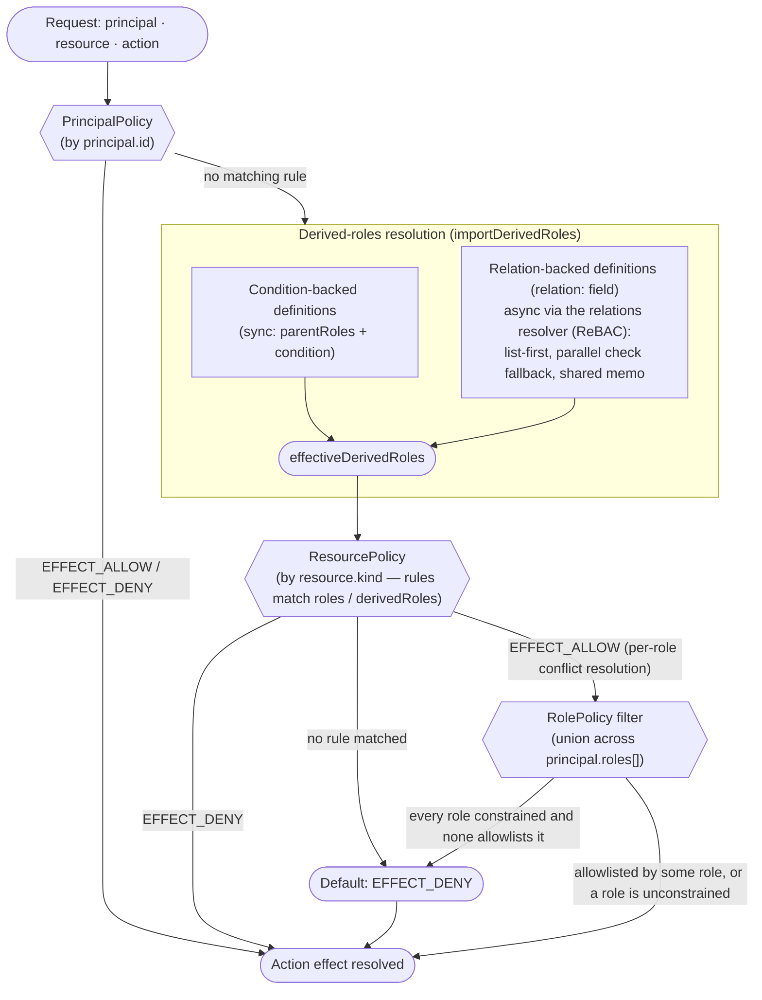
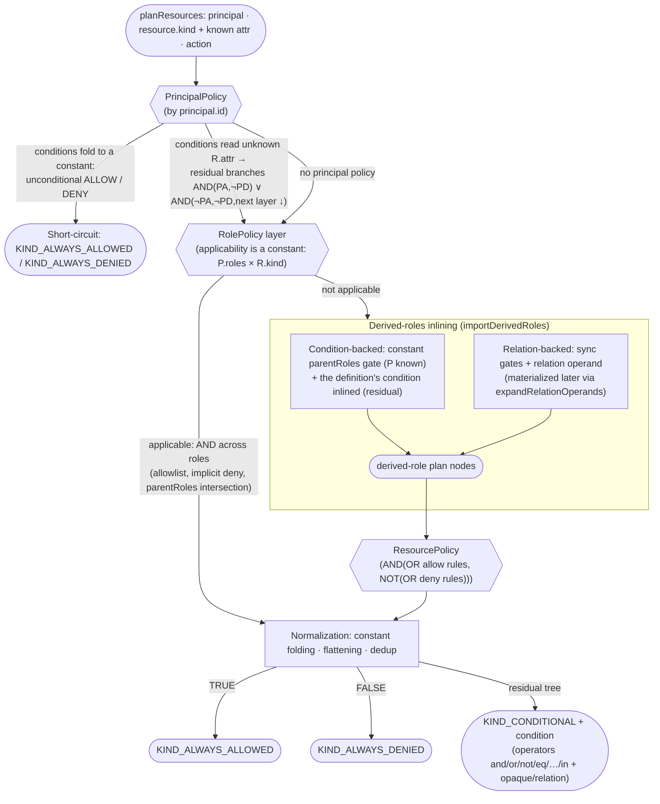

# Kerberos.js

[](https://www.npmjs.com/package/@alexify/kerberos)
[](https://github.com/Alexis-Technologies/kerberos/actions/workflows/ci.yml)
[](#installation)
[](#bundle-size)
[](./LICENSE)

An **embedded, zero-dependency authorization engine** for Node.js and the browser: Cerbos-style policies (RBAC + ABAC), a SpiceDB-inspired "Zanzibar-lite" resolver (ReBAC) and Cerbos-compatible query plans — all in-process, no server to deploy, [~32 KB min+gzip](#bundle-size). The API deliberately stays as close to Cerbos as possible: if you know Cerbos, you already know Kerberos.js.

```javascript
import { Kerberos, Effect } from '@alexify/kerberos';

const kerberos = new Kerberos([{
  resourcePolicy: {
    resource: 'expense',
    version: 'default',
    rules: [{ actions: ['view'], effect: Effect.Allow, roles: ['USER'],
              condition: { match: ({ P, R }) => R.attr.ownerId === P.id } }],
  },
}], []);

await kerberos.isAllowed({
  principal: { id: 'sally', roles: ['USER'] },
  action: 'view',
  resource: { id: 'expense1', kind: 'expense', attr: { ownerId: 'sally' } },
}); // → true
```

### Why in-process?

**Authorization as a library, not a service.** Cerbos and SpiceDB are excellent engines, but each runs as a separate Go server: another deployment, another network hop on every check, another thing that can be down. In a JavaScript stack, Kerberos.js gives you the same policy models with zero infrastructure — decisions are a function call, policies ship (and roll back) atomically with your code, and there is no PDP to keep in sync. A centralized service remains the right choice for polyglot stacks — see [When NOT to use it](#when-not-to-use-kerberosjs).

**Policies are data plus the full power of JavaScript.** In-process policies use plain JS functions for conditions, variables and outputs — no expression-language ceiling. Policies stored in a cache/database use the same shapes with safe, eval-free [`$expr` expressions](#caching--storing-policies). Local testing needs no emulator: the [`/tests` subpath](#testing) runs Cerbos-style declarative test suites against the real engine.

**One engine everywhere.** The [browser build](#browser-usage) contains zero Node builtins, so the same policies that guard your API also gate your UI (hide buttons, filter menus) — without maintaining a second source of truth. Serverless and edge runtimes get the same benefit: no cold-start dependency on an external PDP.

### Positioning

| | **Kerberos.js**                                                                       | **Cerbos**                         | **SpiceDB** |
| --- |---------------------------------------------------------------------------------------|------------------------------------| --- |
| Deployment | in-process library (JS)                                                               | PDP service (sidecar/central)      | central service |
| Policy model | Cerbos-style RBAC+ABAC + ReBAC + query plans                                          | RBAC+ABAC (policies style)         | ReBAC (Zanzibar) |
| Conditions | JS functions / safe `$expr`                                                           | CEL                                | caveats (CEL) |
| Query plans | `planResources` (Cerbos-compatible shape)                                             | `PlanResources`                    | `LookupResources` |
| Consistency | in-process state + your cache ([honest limitations](#consistency-honest-limitations)) | per-PDP policy sync                | Zanzibar consistency (zookies) |
| Best when | JS/TS stack, zero-infra, browser/edge                                                 | polyglot stack, central governance | relationship graphs at scale, strict consistency |

> [!NOTE]
> Compatibility with Cerbos is checked in CI by a [conformance suite](./conformance/) that runs one corpus against both engines — every decision and every query plan is compared to a real Cerbos PDP. Features Kerberos deliberately does not implement (CEL, attribute schemas, `scopePermissions`, `auxData`) are catalogued in [DIVERGENCES.md](./conformance/DIVERGENCES.md).

### When NOT to use Kerberos.js

- **Polyglot backends** — if Go/Python/Java services need the same decisions, a central PDP (Cerbos) beats reimplementing policies per language.
- **Zanzibar-grade consistency** — the built-in ReBAC resolver reads current in-memory/cache state and deliberately has no revision tokens; if the [New Enemy Problem](https://authzed.com/docs/spicedb/concepts/consistency) matters for your threat model, use SpiceDB.
- **Non-engineering policy ownership** — policies here live in code/storage you control; if compliance teams need a managed policy workflow and UI, that is Cerbos Hub's territory.

### Features

| Area | What you get |
| ---- | ------------ |
| **Policy engine** | [Resource / principal / role policies](#policy-types) (with `parentRoles` inheritance), [derived roles](#quick-start), conditions, variables & constants, [outputs](#outputs), [scopes & policy versions](#scopes-and-policy-versions) |
| **APIs** | [`isAllowed`](#kerberosisallowedargs--promiseboolean), [`checkResources`](#kerberoscheckresourcesargs-effectasboolean--false--promisecheckresourcesresponse), [`planResources`](#query-plans-planresources) (Cerbos-compatible query plans) |
| **Dynamic policies** | [Cache-agnostic storage](#caching--storing-policies) with a safe, eval-free `$expr` codec (jsep AST allowlist) |
| **ReBAC** | [Relation-backed derived roles](#rebac-relations) + a built-in Zanzibar-lite resolver (`@alexify/kerberos/relations`) |
| **Observability** | [Audit logs](#options) (console / structured / Pino), [OpenTelemetry](#opentelemetry) traces + metrics, [decision metadata](#decision-metadata-includemeta) |
| **DX** | [Pluggable validation](#schema-validation) (Zod / JSON Schema + Ajv / TypeBox), [testing DSL](#testing) (`/tests`), [typed authoring](#typescript) via an optional app schema, [browser build](#browser-usage), [live playground](https://kerberosjs.vercel.app/playground) |
| **Compatibility** | A [conformance suite](./conformance/) runs one corpus — written in Cerbos's own policy and test formats — against both Kerberos and a real Cerbos PDP in CI; known gaps are listed in [DIVERGENCES.md](./conformance/DIVERGENCES.md) |

> **Version 4.x** — see the [CHANGELOG](./CHANGELOG.md) for everything that changed since `3.1.0`: verified Cerbos compatibility (a conformance corpus replayed against a live PDP, plus the `/cerbos` YAML + CEL policy importer), attribute-schema enforcement, policy-as-code tooling (the `/loader` subpath and the `kerberos` CLI), typed policy authoring, and the code-review hardening waves — a `Conditions` fail-open fix, restored Node-ESM named exports, and a synchronous evaluation driver (~2.5× on simple `isAllowed`).

## Table of Contents

- [Installation](#installation)
  - [Bundle size](#bundle-size) · [Browser usage](#browser-usage)
- [Quick Start](#quick-start)
- [Policy Types](#policy-types)
  - [ResourcePolicy](#resourcepolicy) · [PrincipalPolicy](#principalpolicy) · [RolePolicy](#rolepolicy) · [Mixed Policy Evaluation](#mixed-policy-evaluation)
- [Scopes and Policy Versions](#scopes-and-policy-versions)
- [API Reference](#api-reference)
  - [`new Kerberos(...)`](#new-kerberospolicies-derivedroles-options) · [`isAllowed`](#kerberosisallowedargs--promiseboolean) · [`checkResources`](#kerberoscheckresourcesargs-effectasboolean--false--promisecheckresourcesresponse) · [`planResources`](#kerberosplanresourcesargs--promiseplanresourcesresponse) · [Errors](#errors) · [Exports](#exports)
- [TypeScript](#typescript)
  - [Declaring a schema](#declaring-a-schema) · [What it buys you](#what-it-buys-you) · [Schema helper types](#schema-helper-types)
- [Configuration Options](#configuration-options)
  - [Options](#options) · [Pino logging](#using-pino-for-production-logging) · [Call ID generation](#call-id-generation)
- [Outputs](#outputs)
- [Decision metadata (includeMeta)](#decision-metadata-includemeta)
- [Caching / Storing Policies](#caching--storing-policies)
  - [How it works](#how-it-works-fallback-layer) · [`codec` modes](#codec-option--three-modes) · [Dynamic policy format](#dynamic-policy-format) · [Safe builtins](#allowed-safe-builtins) · [Serialization mechanism](#serialization-mechanism-security--performance)
- [Importing Cerbos Policies](#importing-cerbos-policies)
  - [What is translated](#what-is-translated) · [CEL → `$expr`](#the-cel--expr-translation) · [How this is verified](#how-the-importer-is-verified)
- [Loading Policies from Files](#loading-policies-from-files)
- [ReBAC (Relations)](#rebac-relations)
  - [Relation-backed derived roles](#relation-backed-derived-roles) · [Zanzibar-lite resolver](#the-built-in-zanzibar-lite-resolver) · [Dynamic tuples](#dynamic-tuples-cache-backed) · [Consistency](#consistency-honest-limitations)
- [Query Plans (planResources)](#query-plans-planresources)
  - [How a plan is composed](#how-a-plan-is-composed) · [Operators](#operators) · [Writing plannable policies](#writing-plannable-policies) · [ORM adapters](#using-the-official-cerbos-orm-adapters) · [Translating a plan](#translating-a-plan)
- [Testing](#testing)
  - [CLI](#policy-testing-from-the-command-line)
- [Schema Validation](#schema-validation)
  - [Zod](#using-zod) · [JSON Schema + Ajv](#using-json-schema--ajv) · [TypeBox + Ajv](#using-typebox--ajv) · [Explicit Builders](#using-explicit-builders) · [Attribute schemas](#attribute-schemas-cerbos-schemas)
- [OpenTelemetry](#opentelemetry)
- [Benchmarks](#benchmarks)
- [Changelog](#changelog) · [License](#license) · [Used by](#used-by)

## Installation

```bash
npm install @alexify/kerberos
```

Requires **Node.js ≥ 18** (or any modern browser through a bundler). The package is CommonJS; both `require('@alexify/kerberos')` and `import { Kerberos } from '@alexify/kerberos'` (via Node/bundler ESM interop) work — the examples below use `import`.

### Bundle size

Zero runtime dependencies. Measured with `pnpm size` (esbuild browser bundle, fully minified with identifier mangling, then gzipped):

| Entry | min | min+gzip |
| ----- | ---:| --------:|
| `@alexify/kerberos` (main entry, query planner included) | 115.6 KB | **31.9 KB** |
| `@alexify/kerberos/relations` (opt-in ReBAC resolver) | 60.5 KB | 16.3 KB |
| `@alexify/kerberos/cerbos` (opt-in [Cerbos importer](#importing-cerbos-policies)) | 34.0 KB | 10.9 KB |
| `@alexify/kerberos/loader` (Node-only; browser bundlers get a throwing stub) | 1.0 KB | 0.5 KB |

Every subpath (`/relations`, `/cerbos`, `/loader`, `/tests`) is only bundled if you import it. Optional tooling (`jsep`, `zod`, `ajv`, `@sinclair/typebox`, `@opentelemetry/api`) is never included — you install what you use.

### Browser usage

The package ships two entrypoints: a Node.js entry (`index.js`, uses `node:crypto` / `node:perf_hooks` directly) and a browser entry (`browser.js`) declared via the package.json `browser` field and the `browser` condition in `exports`. Browser bundlers pick the browser build automatically — **no configuration needed** for webpack 5, Vite, esbuild (`platform: 'browser'`), Parcel or Bun. Rollup users need [`@rollup/plugin-node-resolve`](https://github.com/rollup/plugins/tree/master/packages/node-resolve) with `browser: true`.

The browser build contains **zero Node.js builtins** — the only platform-specific code (`generateCallId`, `getNow`) is swapped to a browser implementation backed by `globalThis.crypto.randomUUID` and `globalThis.performance`.

Notes:

- In insecure contexts (plain HTTP), where `crypto.randomUUID` is unavailable, call IDs fall back to a `Math.random`-based pseudo UUID. Call IDs are **correlation identifiers, not security tokens**, so this is safe.
- The package is CommonJS, so browser usage requires a bundler (no bare `<script>` tag).
- Node.js itself ignores the `browser` field entirely — server-side usage (with or without a bundler) always resolves the Node entry.

## Quick Start

A resource policy with a **derived role** (a role computed per request — here, "the owner of this expense"), checked through both public APIs:

```javascript
import { Kerberos, Effect } from '@alexify/kerberos';

const expensePolicy = {
  resourcePolicy: {
    resource: 'expense', // applies to resources of kind 'expense'
    version: 'default',
    importDerivedRoles: ['common_roles'],
    rules: [
      { actions: ['*'], effect: Effect.Allow, roles: ['ADMIN'] },
      { actions: ['view', 'delete'], effect: Effect.Allow, derivedRoles: ['OWNER'] },
      {
        actions: ['view'],
        effect: Effect.Allow,
        roles: ['USER'],
        condition: { match: ({ R }) => R.attr.status === 'OPEN' },
      },
    ],
  },
};

const commonRoles = {
  name: 'common_roles',
  definitions: [
    { name: 'OWNER', parentRoles: ['USER'], condition: { match: ({ P, R }) => R.attr.ownerId === P.id } },
  ],
};

const kerberos = new Kerberos([expensePolicy], [commonRoles]);

// Single decision:
await kerberos.isAllowed({
  principal: { id: 'sally', roles: ['USER'] },
  action: 'delete',
  resource: { id: 'expense1', kind: 'expense', attr: { ownerId: 'sally', status: 'OPEN' } },
}); // → true (OWNER derived role)

// Batch decisions:
const response = await kerberos.checkResources({
  principal: { id: 'frank', roles: ['USER'] },
  resources: [
    { resource: { id: 'expense1', kind: 'expense', attr: { ownerId: 'sally', status: 'OPEN' } }, actions: ['view', 'delete'] },
  ],
});
// {
//   kerberosCallId: 'b9c4362d-…', // generated UUID for audit correlation
//   results: [{
//     resource: { id: 'expense1', kind: 'expense' },
//     actions: { view: 'EFFECT_ALLOW', delete: 'EFFECT_DENY' },
//     outputs: [],
//   }],
// }
```

From here: [principal and role policies](#policy-types) for overrides and allowlists, [`planResources`](#query-plans-planresources) for "which resources can this principal access" filters, [dynamic policies](#caching--storing-policies) for cache-stored rules, and [ReBAC](#rebac-relations) for relationship-based access.

## Policy Types

Kerberos.js supports three policy types:

- **`resourcePolicy`**: selected by `resource.kind`, `resource.policyVersion`, and `resource.scope`
- **`principalPolicy`**: selected by `principal.id`, `principal.policyVersion`, and `principal.scope`
- **`rolePolicy`**: selected by each `principal.roles[]`, `principal.policyVersion`, and `principal.scope`

You can pass either type on its own or mix them in the same constructor call:

```javascript
const kerberos = new Kerberos(
  [
    expenseResourcePolicy,
    sallyPrincipalPolicy,
    userRolePolicy,
  ],
  [commonRoles]
);
```

### ResourcePolicy

`ResourcePolicy` is the workhorse policy type, selected by `resource.kind`. Rules are matched by action, then by `roles` or `derivedRoles`, and may also use `conditions`, `variables`, `constants`, `outputs`, versions, and scopes — see the [Quick Start](#quick-start) for a complete example.

#### Conflict resolution

Conflicts are resolved **per principal role**, matching Cerbos: `EFFECT_DENY` overrides `EFFECT_ALLOW` **within** a role, and an `EFFECT_ALLOW` from **any** role wins across roles. Rule order never decides the outcome.

This is deliberate anti-lockout behaviour — picking up an extra, less privileged role can never take away access another role grants:

```javascript
rules: [
  { actions: ['close'], effect: Effect.Allow, roles: ['SUPPORT'] },
  { actions: ['close'], effect: Effect.Deny, roles: ['AUDITOR'] },
];
// principal roles ['SUPPORT', 'AUDITOR'] -> EFFECT_ALLOW
```

A deny that is meant to hold regardless has to cover the role carrying the allow — either with the `'*'` wildcard or by naming it:

```javascript
{ actions: ['close'], effect: Effect.Deny, roles: ['*'] }                 // always denies
{ actions: ['close'], effect: Effect.Deny, roles: ['SUPPORT', 'AUDITOR'] } // denies both roles
```

Derived roles do not form a dimension of their own: a rule reached through `derivedRoles` counts for the principal roles listed in that definition's `parentRoles`.

### PrincipalPolicy

`PrincipalPolicy` follows the Cerbos-style model for principal-specific overrides. It is bound to a single principal and targets `resource + action` directly instead of `roles` / `derivedRoles`.

```javascript
const sallyPrincipalPolicy = {
  principalPolicy: {
    principal: 'sally',
    version: 'default',
    scope: 'acme.corp',
    constants: {
      restrictedVendor: 'Flux Water Gear',
    },
    variables: {
      isRestrictedVendor: ({ R, C }) => R.attr.vendor === C.restrictedVendor,
    },
    rules: [
      {
        resource: 'expense',
        actions: [
          {
            name: 'deny-restricted-vendor-view',
            action: 'view',
            effect: Effect.Deny,
            condition: {
              match: ({ V }) => V.isRestrictedVendor,
            },
          },
          {
            name: 'allow-delete-override',
            action: 'delete',
            effect: Effect.Allow,
          },
        ],
      },
    ],
  },
};
```

### RolePolicy

`RolePolicy` follows the Cerbos-style role-centric model. It is bound to a single role, targets `resource + allowActions`, and acts as a **narrowing filter over the [`ResourcePolicy`](#resourcepolicy)** — it never grants on its own. Three consequences worth internalising:

- **A role policy cannot allow what the resource policy withholds.** The resource policy is always what grants; a role policy only takes away. With no matching `ResourcePolicy` at all, nothing is allowed.
- **Multiple role policies union.** A principal may do what **any** of its roles permits. Holding an extra role can widen access, never narrow it.
- **A role with no applicable role policy is unrestricted.** If any of the principal's roles has no role policy targeting this resource kind, the filter does not apply at all.

```javascript
// resourcePolicy `report` allows view + edit + delete for roles: ['*']
rolePolicy READER: allowActions: ['view']
rolePolicy WRITER: allowActions: ['edit']

roles: ['READER']            -> view                    (filtered to the allowlist)
roles: ['READER', 'WRITER']  -> view, edit              (union, not intersection)
roles: ['READER', 'PLAIN']   -> view, edit, delete      (PLAIN is unconstrained)
```

```javascript
const userRolePolicy = {
  rolePolicy: {
    role: 'USER',
    version: 'default',
    scope: 'acme.corp',
    constants: {
      restrictedVendor: 'Flux Water Gear',
    },
    variables: {
      isRestrictedVendor: ({ R, C }) => R.attr.vendor === C.restrictedVendor,
    },
    rules: [
      {
        resource: 'expense',
        allowActions: ['create'],
      },
      {
        resource: 'expense',
        allowActions: ['view'],
        condition: {
          match: ({ V }) => V.isRestrictedVendor === false,
        },
      },
    ],
  },
};
```

`RolePolicy` also supports `parentRoles`. Within a single role, the child keeps only actions that are **also** allowed by each locally defined parent role policy (intersection along the inheritance chain — distinct from the union *across* the principal's roles). Missing parent role policies are treated as external IdP roles and do not impose extra constraints inside Kerberos.

### Mixed Policy Evaluation

When mixed policy types are present, Kerberos resolves each action in this order:

1. Find the matching `PrincipalPolicy` for the request principal.
2. If it returns an explicit `EFFECT_ALLOW` or `EFFECT_DENY`, use that result — role policies do not narrow a principal-policy override.
3. Otherwise, evaluate the matching `ResourcePolicy`. Before its rules are matched, the imported **derived roles are resolved**: condition-backed definitions evaluate synchronously, and relation-backed definitions (the `relation:` field) resolve through the configured [`relations` resolver](#rebac-relations) (ReBAC) — `list`-first with parallel `check` fallback, one shared memo per request. The resulting `effectiveDerivedRoles` then participate in rule matching alongside plain `roles`. Conflicts resolve **per principal role**: `EFFECT_DENY` overrides `EFFECT_ALLOW` within a role, an `EFFECT_ALLOW` from any role wins across roles.
4. Apply the `RolePolicy` layer as a **filter** on that result: if every principal role is constrained by an applicable role policy, an `EFFECT_ALLOW` survives only when at least one of those roles allowlists the action (union across roles, `parentRoles` intersection within a role).
5. If nothing matches, return `EFFECT_DENY`.

The decision is computed **per action** — different actions in the same request may be resolved by different policy layers. Each lookup (principal / role / resource) walks the [scope search chain](#scopes-and-policy-versions) and `policyVersion`, and checks in-memory policies first, then the optional `cache`.



> **Within the role layer:** the principal may do what **any** of its roles allowlists (union). A role with no applicable role policy is unrestricted, which disables the filter entirely. When a role declares `parentRoles`, the child keeps only the actions that are **also** allowed by each locally defined parent role policy (intersection along the chain).

This keeps Kerberos.js aligned with the Cerbos-style principal override model described in the [Cerbos principal policies documentation](https://docs.cerbos.dev/cerbos/latest/policies/principal_policies) while extending the runtime with role-centric policy evaluation similar to [Cerbos role policies](https://docs.cerbos.dev/cerbos/latest/policies/role_policies).

## Scopes and Policy Versions

Kerberos.js supports scoped policies and policy versions, allowing you to organize policies for different environments or versions.

Policy selection depends on the policy type:

- **`ResourcePolicy`**
  - `resource.kind`
  - `resource.policyVersion` (defaults to `'default'` when omitted)
  - `resource.scope`
- **`PrincipalPolicy`**
  - `principal.id`
  - `principal.policyVersion` (defaults to `'default'` when omitted)
  - `principal.scope`
- **`RolePolicy`**
  - each `principal.roles[]` entry
  - `principal.policyVersion` (defaults to `'default'` when omitted)
  - `principal.scope`

Scope behavior follows the Cerbos-style model:

- If `scope` is **not** provided for the relevant side of the lookup, Kerberos.js evaluates only the base policy without a scope.
- If `scope` **is** provided, Kerberos.js searches from the most specific scope to the least specific scope, and finally falls back to the base policy.
- Example search chain for `scope: 'acme.corp'`: `acme.corp -> acme -> ''`

When both policy types are loaded, Kerberos first resolves principal overrides using the principal scope/version chain and then falls back to resource policy lookup when the principal policy is not applicable for a given action.

### How the scope chain is evaluated

Matching Cerbos's `SCOPE_PERMISSIONS_OVERRIDE_PARENT` (its default), the chain is not a lookup for one policy — every policy found along it participates, and evaluation is **per action, per principal role**:

- The first scope whose policy produces a decision (allow or deny) for an action and a role **seals** it; policies further up cannot change it.
- A rule whose condition fails decides nothing — the walk **falls through** to the parent scope for that action.
- The walk runs per principal role, so a deny sealing one role at a specific scope does not stop another role from winning an allow at the base scope (allow from any role wins across roles).
- A scope with no policy at all is simply skipped (Cerbos's `lenientScopeSearch`; Kerberos has no strict mode).

Which scope drives which policy type: **resource policies and role policies** walk the *resource's* scope chain; **principal policies** walk the *principal's*. (Cerbos's docs describe role-policy scope as the principal's, but its engine — and a live PDP — match it against the resource's; see [DIVERGENCES.md](./conformance/DIVERGENCES.md).)

### Wildcards

Name fields glob, exactly as in Cerbos: a bare `*` matches anything; in any other pattern `*` matches within a single `:`-delimited segment (`view:*` matches `view:public` but neither the bare `view` nor `view:a:b`), and `**` crosses segments. Globs work in resource-policy `actions` and `roles`, principal-policy `resource` and `action`, role-policy `resource` and `allowActions`, and derived-role `parentRoles`. `rules[].derivedRoles` references are exact names — Cerbos's schema rejects globs there too.


Example:

```javascript
const results = await kerberos.checkResources({
  reqId: 'test-request',
  principal: {
    id: 'alice',
    policyVersion: '20210210',  // Optional: available in request context and logs
    scope: 'acme.corp',         // Optional: available in request context and logs
    roles: ['employee'],
    attr: {
      department: 'accounting',
      geography: 'GB'
    }
  },
  resources: [
    {
      resource: {
        id: 'XX125',
        kind: 'leave_request',
        policyVersion: '20210210', // Optional: specify resource policy version
        scope: 'acme.corp',        // Optional: specify resource scope
        attr: {
          department: 'accounting',
          owner: 'john'
        }
      },
      actions: ['view:public', 'approve', 'create']
    }
  ],
  includeMeta: true  // Optional: include metadata in response
});
```

## API Reference

### `new Kerberos(policies, derivedRoles?, options?)`

| Parameter | Type | Description |
| --------- | ---- | ----------- |
| `policies` | `Array<ResourcePolicy \| PrincipalPolicy \| RolePolicy \| object>` | Static policies loaded into memory. Plain objects are auto-detected by their `resourcePolicy` / `principalPolicy` / `rolePolicy` key. May be empty when policies are resolved from a `cache`. |
| `derivedRoles` | `Array<DerivedRoles \| object>` | Optional derived-role definition sets. |
| `options` | `object` | Optional configuration — see [Configuration Options](#configuration-options). |

### `kerberos.isAllowed(args) => Promise<boolean>`

Evaluates a **single** action against a single resource and returns a boolean.

- `args.principal` — the principal (`id`, `roles`, optional `policyVersion`, `scope`, `attr`).
- `args.action` — the action to check.
- `args.resource` — the resource (`id`, `kind`, optional `policyVersion`, `scope`, `attr`).
- `args.reqId` — optional correlation id echoed in logs.
- `args.includeMeta` — when `true`, enables decision tracing (visible in audit logs).

```javascript
const allowed = await kerberos.isAllowed({
  principal: { id: 'user1', roles: ['USER'], policyVersion: 'default', scope: 'acme.corp' },
  action: 'view',
  resource: { id: 'expense1', kind: 'expense', attr: { amount: 5000, status: 'OPEN' } },
  reqId: 'optional-correlation-id', // optional
});
```

### `kerberos.checkResources(args, effectAsBoolean = false) => Promise<CheckResourcesResponse>`

Evaluates **multiple resources and actions** in a single request.

- `args.principal` — the principal (`id`, `roles`, optional `policyVersion`, `scope`, `attr`).
- `args.resources` — array of `{ resource, actions }` entries.
- `args.reqId` — optional correlation id echoed in the response and logs.
- `args.includeMeta` — when `true`, includes evaluation [metadata](#decision-metadata-includemeta).
- `effectAsBoolean` — when `true`, action results are `true`/`false` instead of `EFFECT_ALLOW`/`EFFECT_DENY`.

```javascript
const response = await kerberos.checkResources({
  principal: { id: 'user1', roles: ['USER'] },
  resources: [{ resource: { id: 'expense1', kind: 'expense' }, actions: ['view', 'create'] }],
});
// {
//   kerberosCallId: 'b9c4362d-…',          // always present, for audit correlation
//   reqId: '…',                            // present only if provided in the request
//   results: [{ resource, actions, outputs, meta? }],
// }
```

### `kerberos.planResources(args) => Promise<PlanResourcesResponse>`

Builds a **resources query plan**: instead of a yes/no decision for one resource, it returns a *filter* describing **which** resources of a kind the principal may act on — ready to translate into a database query. See [Query Plans](#query-plans-planresources).

- `args.principal` — the principal (`id`, `roles`, optional `policyVersion`, `scope`, `attr`).
- `args.resource` — the resource **kind** (`kind`, optional `policyVersion`, `scope`, `attr`). No `id`: `attr` carries only the *known* attributes; everything else stays unknown and surfaces in the filter.
- `args.action` **or** `args.actions` — exactly one of them; multiple actions plan the conjunction (Cerbos AND semantics). The wildcard `'*'` cannot be planned.
- `args.reqId` / `args.includeMeta` — as in `checkResources`; `includeMeta` adds `filterDebug`, `matchedScopes` and the `resolution` trace.

```javascript
const plan = await kerberos.planResources({
  principal: { id: 'user1', roles: ['USER'] },
  resource: { kind: 'expense' },
  action: 'view',
});
// {
//   kerberosCallId: '…', action: 'view', resourceKind: 'expense', policyVersion: 'default',
//   filter: { kind: 'KIND_ALWAYS_ALLOWED' | 'KIND_ALWAYS_DENIED' | 'KIND_CONDITIONAL', condition? },
// }
```

### Errors

All error classes are exported from the main entry. Evaluation-phase errors follow the [`onError`](#options) option; `KerberosValidationError` always throws.

| Class | Thrown when |
| ----- | ----------- |
| `KerberosValidationError` | Malformed method arguments or request shapes (always propagates — a programming error, not a deny). |
| `KerberosCacheError` | A transient `cache.get` failure persists after the [`cacheRetry`](#options) attempts. |
| `KerberosCodecError` | A cached policy/tuple document is corrupt or fails to deserialize (for policies it is logged and counts as a miss; for ReBAC tuple documents it throws — see [Dynamic tuples](#dynamic-tuples-cache-backed)). |
| `KerberosExprError` | A `{ $expr }` string uses a construct outside the [safe allowlist](#allowed-safe-builtins), exceeds codec limits, or fails to parse. |
| `KerberosRelationsError` | The built-in ReBAC resolver hits `maxDepth`, a throwing caveat, or invalid relation data. |

### Exports

| Export | Purpose |
| ------ | ------- |
| `Kerberos` | Main authorization engine. |
| `Effect` | `{ Allow: 'EFFECT_ALLOW', Deny: 'EFFECT_DENY' }` — a frozen const object, [not an `enum`](#typescript). |
| `ResourcePolicy`, `PrincipalPolicy`, `RolePolicy`, `DerivedRoles` | Policy classes (rarely constructed directly). |
| `Conditions`, `Variables`, `Constants`, `Outputs` | DSL building blocks. |
| `createSafeExprCodec`, `serializePolicy`, `deserializePolicy` | Safe AST codec for [dynamic/stored policies](#caching--storing-policies). |
| `PlanKind` | `{ AlwaysAllowed, AlwaysDenied, Conditional }` — [query plan](#query-plans-planresources) filter kinds. |
| `expandRelationOperands` | Materializes ReBAC `relation` operands of a [query plan](#query-plans-planresources) into id filters. |
| `toCerbosQueryPlan` | Converts a plan to the `@cerbos/core` SDK shape for the [official Cerbos ORM adapters](#using-the-official-cerbos-orm-adapters). |
| `KerberosValidationError`, `KerberosCacheError`, `KerberosCodecError`, `KerberosExprError`, `KerberosRelationsError` | Typed [error classes](#errors). |
| `registerAjvKeywords`, `createAjvAdapter` | [Validation](#schema-validation) helpers. |
| `resolveValidationAdapter`, `toValidationAdapter`, `parseWithValidation` | Backend dispatch used by every DSL module — pick an adapter (explicit → Zod → TypeBox+Ajv → JSON Schema+Ajv → passthrough) and parse with it. |
| `createCacheReader` | Wraps any `get(key)` store as the engine's read-only [policy fallback layer](#caching--storing-policies). |
| `JsonSchemas`, `TypeBoxSchemas`, `ZodSchemas`, `KerberosJsonSchemas`, `ResourcePolicyJsonSchemas`, `PrincipalPolicyJsonSchemas`, `RolePolicyJsonSchemas`, … | Schema builders for the three backends. |
| `ALL_ACTIONS`, `ALL_ROLES`, `ALL_RESOURCES`, `DEFAULT_VERSION`, `BASE_SCOPE` | Wildcard/default tokens (`'*'`, `'default'`, `''`). |

Subpath **`@alexify/kerberos/relations`** (opt-in ReBAC — kept out of the main entry so non-ReBAC bundles do not grow):

| Export | Purpose |
| ------ | ------- |
| `RelationResolver` | The built-in [Zanzibar-lite resolver](#the-built-in-zanzibar-lite-resolver) (check / list / lookupSubjects / lookupResources). |
| `RelationSchema` | Compiles the relation-schema DSL standalone (validated schemas reusable across resolvers). |
| `Relations*Schemas` | Schema builders for the resolver's shapes (three validation backends). |
| `parseRelationSchemaShape`, `parseObjectRef`, `parseSubjectRef`, `parseTuple` | Standalone parsers/validators for schema documents, `type:id` refs and tuples. |
| `buildAdmissionKey` | Builds the `type` + `relation` + `subjectType` admission key the compiled schema indexes by. |

Subpath **`@alexify/kerberos/tests`** (dev/test only — not loaded by the main entry):

| Export | Purpose |
| ------ | ------- |
| `KerberosTest`, `KerberosTests` | Cerbos-style declarative test runner. |
| `PrincipalMock`, `PrincipalsMock`, `ResourceMock`, `ResourcesMock` | Named fixtures for test suites. |
| `*ZodSchemas`, `*JsonSchemas`, `*TypeBoxSchemas` | Schema builders for the test harness. |

Subpath **`@alexify/kerberos/loader`** (Node-only [file/directory loader + versioned bundles](#loading-policies-from-files); browser bundlers substitute throwing stubs):

| Export | Purpose |
| ------ | ------- |
| `loadPolicyDirectory`, `loadPolicyFile` | Read Kerberos JSON / Cerbos YAML+JSON policy files (+ `_schemas/`) into constructor inputs. |
| `createPolicyBundle`, `writePolicyBundle`, `loadPolicyBundle` | Hash-stamped (SHA-256, content-addressed) policy bundles with load-time integrity verification. |
| `promises` | The [asynchronous driver](#loading-policies-from-files) — the same four functions returning promises, reading files concurrently (`concurrency`, default 64). |
| `KerberosLoaderError` | Typed error for I/O, format and bundle-integrity failures (carries `file`). |

Subpath **`@alexify/kerberos/cerbos`** (the [Cerbos policy importer](#importing-cerbos-policies) — kept out of the main entry):

| Export | Purpose |
| ------ | ------- |
| `importCerbosPolicies` | Cerbos YAML/JSON documents → `{ policies, derivedRoles }` serialized Kerberos documents. |
| `celToExpr` | Translates one CEL expression into a `$expr`-compatible JavaScript expression string. |
| `parseYamlDocuments` | The zero-dependency YAML-subset parser, standalone. |
| `KerberosImportError` | Typed error for unsupported constructs (carries `line` for YAML errors). |

## TypeScript

Kerberos.js ships hand-maintained types. By default every position is open — `kind` and `action` are `string`, `attr` is `Record<string, unknown>` — which is what you want for policies loaded from a store at runtime.

When your resource kinds are known at compile time, declare them once and the whole surface narrows to them.

### Declaring a schema

```typescript
import { Kerberos, Effect, type KerberosPolicy } from '@alexify/kerberos';

type AppSchema = {
  principal: {
    roles: 'admin' | 'user';
    attr: { department: string; clearance: number };
  };
  resources: {
    document: { actions: 'view' | 'edit' | 'delete'; attr: { ownerId: string; status: 'draft' | 'published' } };
    invoice: { actions: 'view' | 'approve'; attr: { amount: number } };
  };
};

const kerberos = new Kerberos<AppSchema>(policies, derivedRoles);
```

Both keys are optional — declare only `resources` if you do not want to enumerate roles.

### What it buys you

The resource kind drives everything else. `action`, `attr`, and the condition callbacks all narrow to the kind you named:

```typescript
await kerberos.isAllowed({
  principal: { id: 'u1', roles: ['admin'], attr: { department: 'eng', clearance: 3 } },
  resource: { kind: 'document', id: 'd1', attr: { ownerId: 'u1', status: 'draft' } },
  action: 'edit', // ✅ autocompleted from `document`'s actions
});

await kerberos.isAllowed({
  principal: { id: 'u1', roles: ['admin'] },
  resource: { kind: 'document', id: 'd1' },
  action: 'approve', // ❌ 'approve' belongs to `invoice`, not `document`
});
```

Policy documents are checked the same way — `resource:` discriminates the rules, so a typo in an action or a role is a compile error rather than a silent `EFFECT_DENY` at 3am:

```typescript
const policy: KerberosPolicy<AppSchema> = {
  resourcePolicy: {
    version: 'default',
    resource: 'document',
    rules: [
      { actions: ['view', 'edit'], effect: Effect.Allow, roles: ['admin'] },
      {
        actions: ['edit'],
        effect: Effect.Allow,
        roles: ['user'],
        // R.attr is { ownerId: string; status: 'draft' | 'published' }
        condition: { match: ({ R, P }) => R.attr?.ownerId === P.id && R.attr?.status === 'draft' },
      },
    ],
  },
};
```

`checkResources` keeps each batch entry typed independently, so a mixed batch still catches a wrong action per kind:

```typescript
const { results } = await kerberos.checkResources({
  principal: { id: 'u1', roles: ['user'] },
  resources: [
    { resource: { kind: 'document', id: 'd1' }, actions: ['view', 'edit'] },
    { resource: { kind: 'invoice', id: 'i1' }, actions: ['approve'] },
  ],
});
```

The second argument now selects the effect representation through overloads: `checkResources(args)` resolves `results[].actions` to `Effect`, and `checkResources(args, true)` to `boolean` — previously both were typed as the `Effect | boolean` union.

### Schema helper types

Exported so you can build your own typed wrappers (an Express middleware, a React hook) over the same schema:

| Type | Resolves to |
| ---- | ----------- |
| `ResourceKindOf<S>` | Union of declared resource kinds. |
| `ActionOf<S, K>` | Actions for kind `K`; every action across all kinds when `K` is omitted. |
| `ResourceAttrOf<S, K>` | Attribute bag of kind `K`. |
| `PrincipalRoleOf<S>` / `PrincipalAttrOf<S>` | Declared principal roles / attributes. |
| `RequestPrincipal<S>`, `RequestResource<S, K>`, `BaseRequest<S, K>` | Request shapes. |
| `PolicyEvalRequest<S, K>` | The `{ P, R, V, C }` envelope a condition/variable/output callback receives. |
| `CheckResourcesArgs<S>`, `CheckResourcesResponse<S, E>`, `PlanResourcesArgs<S, K>`, `PlanResourcesResponse<S>` | Method arguments and responses. |
| `AnySchema` | The permissive default used when no schema is supplied. |

> [!NOTE]
> Typing is **compile-time only** — there is no runtime cost and no runtime enforcement. A schema constrains the policies and requests you write in TypeScript; it does not validate policies loaded from a cache at runtime. For that, use [schema validation](#schema-validation).

`Effect` and `PlanKind` are const objects rather than TypeScript `enum`s, so the raw wire strings that a stored policy or a serialized plan actually carries stay assignable:

```typescript
const rule = { actions: ['view'], effect: 'EFFECT_ALLOW', roles: ['user'] }; // ✅ no `Effect.Allow` needed
```

## Configuration Options

The Kerberos constructor accepts an optional third parameter with configuration options:

```javascript
const kerberos = new Kerberos(policies, derivedRoles, {
  logger: true, // Legacy console audit logging with summary + table + debug(json)
  onError: 'deny', // 'throw' (default) or 'deny' — fail-closed evaluation errors
  telemetry, // Optional: OpenTelemetry traces + metrics ({ api } or { tracer, meter })
  cache, // Optional: any cache solution exposing get(key) (keyv, cacheable, ...)
  cacheRetry: { attempts: 3 }, // Optional: retry policy for transient cache.get failures
  codec, // Optional: (de)serialization codec for dynamic policies ({ jsep } or { deserialize })
  relations, // Optional: ReBAC resolver for relation-backed derived roles
  z, // Optional: validate with Zod
  ajv, // Optional: validate with Ajv
  typebox: Type, // Optional: switch Ajv validation to TypeBox builders
  getCallId: () => `custom-${Date.now()}`, // Custom call ID generator (optional)
});
```

### Options

- **`logger`** (boolean | KerberosLogger): Enable audit logging.
  - `true` keeps the legacy console behavior with `group + summary + table + debug(json)`
  - `false` or omitted disables logging
  - a custom `console`-like logger keeps the legacy table/json flow
  - a structured logger such as `Pino` receives one structured audit entry per evaluated action
  - Logging is pure observability: it never changes decisions or error behavior (that is [`onError`](#options)'s job), and a throwing logger is swallowed — it can never affect authorization.
- **`onError`** (`'throw' | 'deny'`, default `'throw'`): What happens when policy **evaluation** fails at runtime (a throwing condition function, a failing cache backend, a ReBAC resolver error).
  - `'throw'` propagates the error to the caller;
  - `'deny'` fails closed: `isAllowed` resolves to `false`, `checkResources` to one all-DENY result per requested resource (positional parity with the request, like the per-resource fail-closed path — entries that cannot be echoed back from malformed arguments are skipped), `planResources` to a `KIND_ALWAYS_DENIED` filter.
  - Malformed **arguments** are programming errors and always throw `KerberosValidationError`, regardless of this option.

  ```javascript
  // Fail-closed setup: evaluation errors deny instead of throwing.
  const kerberos = new Kerberos(policies, derivedRoles, { onError: 'deny' });
  ```

- **`telemetry`** (KerberosTelemetryOptions): Enable OpenTelemetry traces and metrics. Pass `{ api }` (the `@opentelemetry/api` module) or `{ tracer, meter }` instances — see [OpenTelemetry](#opentelemetry).
- **`cache`** (CacheLike): An optional cache used as a fallback source for dynamic/stored policies. Any object exposing a `get(key)` method is accepted (keyv, cacheable, cache-manager, ...). See [Caching / Storing policies](#caching--storing-policies).
- **`cacheRetry`** (`{ attempts?, delayMs?, jitter?, timeoutMs?, onExhausted? }`, default `{ attempts: 3, delayMs: 25, jitter: true }`): Retry policy for `cache.get` failures. Attempts are spaced by full-jitter exponential backoff (`delayMs` base, doubling per attempt; `delayMs: 0` restores immediate retries); deterministic adapter errors (`TypeError`/`SyntaxError`) are never retried. `timeoutMs` (off by default) bounds each read attempt so a *hung* backend fails instead of hanging authorization. After the attempts are exhausted the failure surfaces as `KerberosCacheError` (and then follows `onError`) — unless `onExhausted: 'miss'` opts into **degraded mode**: the read counts as a cache miss and evaluation falls through to the remaining static sources, so a cache outage no longer disables statically-resolvable decisions (the degradation stays visible via the `kerberos.cache.requests` `error` metric and a guarded error log entry). `attempts: 1` disables retrying.
- **`cacheKeyPrefix`** (`string`, default `''`): Prefix prepended to **every** cache key (policies *and* derived roles). Use it to namespace tenants or environments sharing one store — derived-roles documents are otherwise a single global `derivedRoles:<name>` namespace, so two tenants publishing the same definition name on a shared store would silently overwrite each other.
- **`relationsTimeoutMs`** (`number`, off by default): Bounds each `relations.check` / `relations.list` call; a resolver that neither resolves nor rejects fails as `KerberosRelationsError` (following `onError`) instead of hanging the request.
- **`audit`** (`{ includeMeta?: boolean }`): Engine-level audit enrichment. With `{ includeMeta: true }` and a logger attached, decision tracing runs for **every** request, so audit entries always carry `meta.resolution` and the `policy-miss` reason — audit completeness stops depending on each call site remembering the per-request `includeMeta` flag. The response stays gated on the request flag.
- **`maxConcurrency`** (`number`, unbounded by default): Caps how many resources of a `checkResources` batch evaluate at once. Without it a 10k-resource batch launches 10k concurrent evaluation chains (each issuing its own cache reads) — memory spikes, event-loop saturation and a thundering herd on the cache backend. The built-in `RelationResolver` accepts the same option for its `lookupResources` candidate-verification fan-out.
- **`codec`** (PolicyCodec): How cached policy documents are transformed before construction: `{ jsep }` enables the built-in safe `$expr` evaluator, `{ deserialize }` plugs in your own logic, and when omitted cached values are passed to policy constructors **as-is** — see [`codec` option — three modes](#codec-option--three-modes).
- **`schemas`** (`{ enforcement?, definitions? }`): **Attribute schema enforcement** — Cerbos [`schemas`](https://docs.cerbos.dev/cerbos/latest/policies/schemas) parity. Resource policies declare `schemas.principalSchema` / `resourceSchema` refs (with optional `ignoreWhen.actions` globs); this option maps the refs to validators and picks the level: `'reject'` (default when set) denies requests whose attributes fail validation, `'warn'` reports without changing decisions, `'none'` disables (the Cerbos default when unconfigured). Failures are returned as Cerbos-shaped `validationErrors` (`{ path, message, source }`) on `checkResources` results — regardless of `includeMeta` — and reach the audit log. A definition may be a JSON Schema object (compiled with the `ajv` option), a Zod schema, or a validator function. See [Attribute schemas](#attribute-schemas-cerbos-schemas).
- **`relations`** (KerberosRelationsResolver): ReBAC resolver used by relation-backed derived roles — any object with a `check(args, opts)` method (and an optional batched `list`). See [ReBAC (Relations)](#rebac-relations).
- **`z`**: Enables validation using the built-in Zod schema builders.
- **`ajv`**: Enables validation using the built-in JSON Schema builders compiled with Ajv.
- **`typebox`**: When used together with `ajv`, switches validation to the built-in TypeBox builders.
- **`getCallId`** (function): Custom function to generate call IDs for audit tracking. 
  - **Default behavior**: Uses `crypto.randomUUID()` in Node.js, `window.crypto.randomUUID()` in browsers, or falls back to a pseudo UUID generator
  - **Custom example**: `() => \`req-\${Date.now()}-\${Math.random()}\``

### Using Pino for Production Logging

If you want machine-readable audit logs in production, pass a `Pino` instance as the `logger` option:

```javascript
import pino from 'pino';
import { Kerberos } from '@alexify/kerberos';

const logger = pino({ level: 'info' });

const kerberos = new Kerberos(policies, derivedRoles, {
  logger,
});
```

With `Pino`, Kerberos emits structured audit entries that include `callId`, `reqId`, `reqKind`, `principalId`, `principalRoles` (the role set the decision was based on — roles change over time, so past entries stay explainable), `resourceId`, `action`, `effect`, `outputs`, and `meta`. Fail-closed denials are part of the stream too: a resource whose evaluation failed inside a `checkResources` batch (and the `onError: 'deny'` fallback of `isAllowed`) logs its DENY decisions marked `reason: 'evaluation-error'`, and `planResources` results (`PlanResources.result`, with the filter kind) go out at **info** level like other decision entries — only lifecycle `*.start`/`*.finish` events sit at debug. This mode is better suited for production ingestion than the default console table output.

It also emits lifecycle logs such as `IsAllowed.start`, `IsAllowed.error`, `IsAllowed.finish`, `CheckResources.start`, `CheckResources.finish` and `PlanResources.*`. Errors are always logged, but whether they are rethrown or converted into a fail-closed response is decided solely by the [`onError`](#options) option — never by the logger.

### Call ID Generation

Every request (`isAllowed` / `checkResources` / `planResources`) automatically generates a unique `kerberosCallId` for audit tracking:

- **Node.js**: Uses `crypto.randomUUID()` 
- **Browser**: Uses `window.crypto.randomUUID()`
- **Fallback**: Pseudo UUID v4 generator if crypto APIs are unavailable
- **Custom**: Provide your own `getCallId` function for custom ID formats

This ID is included in both the response and audit logs for correlation.

## Outputs

Kerberos.js supports outputs functionality similar to Cerbos. You can define output expressions that are evaluated when policy rules are activated or when conditions are not met. These outputs are included in the API response and can be used to provide detailed information about policy decisions.

### Defining Outputs

You can add output functions to your policy rules:

```javascript
const policyWithOutputs = {
  resourcePolicy: {
    version: 'default',
    resource: 'system_access',
    rules: [
      {
        name: 'working-hours-only',
        actions: ['*'],
        effect: Effect.Deny,
        roles: ['*'],
        condition: {
          match: () => {
            const now = new Date();
            return now.getHours() > 18 || now.getHours() < 8;
          }
        },
        output: {
          when: {
            ruleActivated: ({ P, R }) => ({
              principal: P.id,
              resource: R.id,
              timestamp: new Date().toISOString(),
              message: "System can only be accessed between 0800 and 1800"
            }),
            conditionNotMet: ({ P, R }) => ({
              principal: P.id,
              resource: R.id,
              timestamp: new Date().toISOString(),
              message: "System can be accessed at this time"
            })
          }
        }
      },
      {
        name: 'admin-access',
        actions: ['*'],
        effect: Effect.Allow,
        roles: ['admin'],
        output: {
          when: {
            ruleActivated: ({ P }) => ({
              message: "Admin access granted",
              admin: P.id
            })
          }
        }
      }
    ]
  }
};
```

### Using checkResources with Outputs

The `checkResources` method returns outputs in the response:

```javascript
const results = await kerberos.checkResources({
  principal: {
    id: 'john',
    roles: ['user']
  },
  resources: [
    {
      resource: {
        id: 'bastion_002',
        kind: 'system_access'
      },
      actions: ['login']
    }
  ]
});

console.log(results);
// {
//   results: [
//     {
//       resource: { id: 'bastion_002', kind: 'system_access' },
//       actions: { login: 'EFFECT_DENY' },
//       outputs: [
//         {
//           src: 'resource.system_access.vdefault#working-hours-only',
//           val: {
//             principal: 'john',
//             resource: 'bastion_002',
//             timestamp: '2023-06-02T20:53:58.319Z',
//             message: 'System can only be accessed between 0800 and 1800'
//           }
//         }
//       ]
//     }
//   ]
// }
```

### Output Function Syntax

Output functions are JavaScript functions that receive the request context and return any value:

```javascript
// Basic function syntax
({ P, R, V, C }) => {
  // Your logic here
  return {
    principal: P.id,
    resource: R.kind,
    timestamp: new Date().toISOString()
  };
}
```

Available context parameters:

- **P**: Principal object with `id`, `roles`, and `attr`
- **R**: Resource object with `id` and `kind`
- **V**: Variables (computed values)
- **C**: Constants (static values)

Output functions are called when:

- **ruleActivated**: The rule matches and its condition is satisfied
- **conditionNotMet**: The rule matches but its condition is not satisfied

The output `src` field reflects the policy type that produced it:

- Resource policy example: `resource.expense.vdefault#rule-name`
- Principal policy example: `principal.sally.vdefault#rule-name`

## Decision metadata (includeMeta)

When `includeMeta: true` is set, the response includes additional metadata about policy evaluation:

```javascript
const results = await kerberos.checkResources({
  principal: { 
    id: 'alice', 
    scope: 'acme.corp',
    roles: ['employee'] 
  },
  resources: [
    {
      resource: { 
        id: 'XX125', 
        kind: 'leave_request',
        policyVersion: '20210210',
        scope: 'acme.corp' 
      },
      actions: ['view:public', 'approve']
    }
  ],
  includeMeta: true
});

console.log(results);
// {
//   reqId: 'test-request',
//   kerberosCallId: 'b9c4362d-b92a-4c2b-9d49-845f00d7a372',
//   results: [
//     {
//       resource: {
//         id: 'XX125',
//         kind: 'leave_request',
//         policyVersion: '20210210',
//         scope: 'acme.corp'
//       },
//       actions: {
//         'view:public': 'EFFECT_ALLOW',
//         'approve': 'EFFECT_DENY'
//       },
//       outputs: [
//         {
//           src: 'resource.leave_request.v20210210/acme.corp#rule-001',
//           val: 'create_allowed:john'
//         }
//       ],
//       meta: {
//         actions: {
//           'view:public': {
//             matchedPolicy: 'resource.leave_request.v20210210/acme.corp',
//             matchedRule: 'resource.leave_request.v20210210/acme.corp#rule-001',
//             matchedScope: 'acme.corp'
//           },
//           'approve': {
//             matchedPolicy: 'resource.leave_request.v20210210/acme.corp',
//             reason: 'condition-not-met'
//           }
//         },
//         effectiveDerivedRoles: [
//           'employee_that_owns_the_record',
//           'any_employee'
//         ],
//         resolution: [
//           { source: 'principal', id: 'alice', version: 'default',
//             scopesSearched: ['acme.corp', 'acme', ''], matchedScope: null },
//           { source: 'resource', id: 'leave_request', version: '20210210',
//             scopesSearched: ['acme.corp', 'acme', ''], matchedScope: 'acme.corp' }
//         ]
//       }
//     }
//   ]
// }
```

Per action, `meta.actions[action]` includes:

- **matchedPolicy**: The policy source that produced the decision — a resource source such as `resource.expense.vdefault/acme.corp`, a principal source such as `principal.sally.vdefault/acme.corp`, or a role source such as `role.USER.vdefault`
- **matchedRule**: The exact rule that produced the decision
- **matchedScope**: The scope of the matched policy (present for scoped policies)
- **reason** (denied actions only): why nothing allowed the action — `'rule-miss'` (no rule targeted the action / matched the principal's roles), `'condition-not-met'` (a rule targeted it but its condition failed), `'policy-miss'` (no applicable policy existed at all) or `'evaluation-error'` (the resource's evaluation rejected inside a `checkResources` batch and failed closed — paired with `errorName` so an outage is distinguishable from a policy DENY)

At the result level:

- **effectiveDerivedRoles**: derived roles that activated for this resource
- **resolution** (decision trace): every policy lookup that was attempted — `{ source, id, version, scopesSearched, matchedScope, origin? }` entries (with `origin: 'cache'` for cache-resolved policies), `{ source: 'derivedRoles', name, matched, origin? }` entries for every imported derived-roles set (`matched: false` = the import resolved nowhere — e.g. an evicted or corrupt cache document silently stopping rules from matching), plus `{ source: 'relations', name, relation, matched, reason? }` entries for [relation-backed derived roles](#rebac-relations). The same trace appears in [`planResources` meta](#query-plans-planresources).

## Caching / Storing policies

Kerberos.js can resolve policies dynamically from a remote store (Redis, MongoDB, PostgreSQL, in-memory, ...) instead of loading every policy up front. Following the same delegating philosophy as the `logger` option, Kerberos stays **agnostic**: it does not implement caching, TTL or invalidation logic itself. You pass a `cache`, and Kerberos simply calls `cache.get(key)` when it needs a policy. Everything else — storage, layering, expiry, and multi-host invalidation — is delegated to dedicated solutions such as [`keyv`](https://keyv.org), [`cacheable`](https://cacheable.org) (`CacheSync`) and [`qified`](https://qified.org).

### How it works (fallback layer)

Static policies passed to the constructor stay in memory; the `cache` is a fallback source. Resolution collects the **whole policy chain** along the scope search chain, with per-scope precedence:

1. For each scope in the chain (most specific → base), look the policy up in memory first, then — only on a miss at that scope, and only if a `cache` is configured — call `await cache.get(key)`.
2. On a hit, the JSON document is handled according to the `codec` option (see below).
3. Every policy found participates in [per-action scope evaluation](#scopes-and-policy-versions) — a more specific policy decides first, and actions it does not decide fall through to less specific ones.
4. If nothing matches, the action falls back to `EFFECT_DENY` (unchanged behavior).

> [!NOTE]
> Precedence is **per scope**: an in-memory policy wins at its own scope, but no longer shadows a *more specific* cached policy at a deeper scope. Hybrid deployments (static org-wide defaults in code + per-tenant overrides in the store) resolve the way scope specificity implies.

Cache keys follow this layout:

| Policy type     | Key format                                |
| --------------- | ----------------------------------------- |
| Resource policy | `resource:<kind>:<version>:<scope>`       |
| Principal policy| `principal:<id>:<version>:<scope>`        |
| Role policy     | `role:<role>:<version>:<scope>`           |
| Derived roles   | `derivedRoles:<name>`                     |

`<version>` defaults to `default`, and `<scope>` is empty for unscoped policies (e.g. `resource:expense:default:`).

### `CacheLike`

The only requirement is a single `get` method, so any cache backend works:

```typescript
type CacheLike = {
  get(key: string): unknown | Promise<unknown>;
};
```

### `codec` option — three modes

The `codec` option controls how a value returned from the cache is transformed before being passed to the policy constructor:

| Provided option | Behaviour |
| --------------- | --------- |
| `codec: { jsep }` | Kerberos uses the **built-in AST allowlist evaluator** with the pre-configured `jsep` instance you supply. `{ $expr: "..." }` descriptors are resolved into runtime evaluator functions. |
| `codec: { deserialize }` | Your own **custom deserialization** function is called on the raw cached value. |
| *(omit `codec`)* | The cached value is **passed as-is** to the policy constructor — no `{ $expr }` transformation. Use this when your stored JSON documents don't contain expression descriptors (e.g. plain rules with static `effect` and `roles`). |

> **`jsep` is not a dependency of `@alexify/kerberos`.** It is deliberately kept out so you only pay for it when you need expression-based policies. Install it (and any plugins) separately and pass the instance to Kerberos.

```bash
npm install jsep @jsep-plugin/object @jsep-plugin/ternary @jsep-plugin/new
```

### Dynamic policy format

Because a remote store can be Redis/Mongo/Postgres/etc., dynamic policies must be **JSON documents**. JSON has no concept of a JavaScript function, so `conditions`, `variables` and `outputs` are authored as **expression descriptors** `{ "$expr": "..." }` instead of JS functions:

```javascript
// In-memory policy (function form):
condition: { match: ({ R, P }) => R.attr.ownerId === P.id }

// Dynamic/stored policy (JSON, $expr form):
"condition": { "match": { "$expr": "R.attr.ownerId == P.id" } }
```

A full stored resource policy document looks like:

```json
{
  "resourcePolicy": {
    "version": "default",
    "resource": "document",
    "importDerivedRoles": ["doc_roles"],
    "variables": { "isOpen": { "$expr": "R.attr.status == 'OPEN'" } },
    "rules": [
      { "actions": ["*"], "effect": "EFFECT_ALLOW", "roles": ["ADMIN"] },
      { "actions": ["view"], "effect": "EFFECT_ALLOW", "derivedRoles": ["OWNER"] },
      {
        "name": "edit-when-open",
        "actions": ["edit"],
        "effect": "EFFECT_ALLOW",
        "derivedRoles": ["OWNER"],
        "condition": { "match": { "$expr": "V.isOpen" } },
        "output": { "when": { "ruleActivated": { "$expr": "({ owner: R.attr.ownerId, by: P.id })" } } }
      }
    ]
  }
}
```

Expressions are evaluated against the same request context as functions: `P` (principal), `R` (resource), `V` (variables), `C` (constants), plus a curated set of **safe language builtins** (see below).

### Allowed safe builtins

The default codec exposes a small, allowlisted subset of JavaScript that is useful in policy conditions without opening an `eval` trust boundary:

| Category | Supported constructs |
| -------- | -------------------- |
| **Math** | `Math.abs`, `Math.min`, `Math.max`, `Math.floor`, `Math.ceil`, `Math.round`, `Math.pow`, ... |
| **Date** | `new Date()`, `new Date(value)`, `Date.now()`, `Date.parse(...)`, `Date.UTC(...)`, and read-only instance methods such as `.getTime()`, `.getHours()`, `.toISOString()` |
| **Coercion / parsing** | `parseInt(...)`, `parseFloat(...)`, `Number(...)`, `String(...)`, `Boolean(...)`, `isNaN(...)`, `isFinite(...)` |
| **Value helpers** | Safe string/array methods such as `.includes()`, `.startsWith()`, `.slice()`, ... |

Anything outside this list — arbitrary constructors (`new Function`, `new Object`, ...), global roots like `process` / `require` / `globalThis`, or member keys such as `constructor` / `__proto__` — is rejected by the AST allowlist interpreter.

Example: a time-window condition (equivalent to the in-memory expense delete rule) in `{ $expr }` form:

```json
{
  "condition": {
    "match": {
      "$expr": "(Date.now() - new Date(R.attr.createdAt).getTime()) < 3600000 && R.attr.status == 'OPEN'"
    }
  }
}
```

### Example 1: a simple Keyv cache

```javascript
import { Keyv } from 'keyv';
import jsep from 'jsep';
import jsepObject from '@jsep-plugin/object';
import jsepTernary from '@jsep-plugin/ternary';
import jsepNew from '@jsep-plugin/new';
import { Kerberos, serializePolicy } from '@alexify/kerberos';

// 1. Configure jsep once — register plugins and any extra unary operators.
jsep.plugins.register(jsepObject, jsepTernary, jsepNew);
jsep.addUnaryOp('typeof');

const keyv = new Keyv();

// 2. Serialize policies into JSON-safe documents (validates $expr ASTs via jsep).
await keyv.set('derivedRoles:doc_roles', serializePolicy({
  name: 'doc_roles',
  definitions: [
    { name: 'OWNER', parentRoles: ['USER'], condition: { match: { $expr: 'R.attr.ownerId == P.id' } } },
  ],
}, { jsep }));

await keyv.set('resource:document:default:', serializePolicy({
  resourcePolicy: {
    version: 'default',
    resource: 'document',
    importDerivedRoles: ['doc_roles'],
    rules: [
      { actions: ['view'], effect: 'EFFECT_ALLOW', derivedRoles: ['OWNER'] },
    ],
  },
}, { jsep }));

// 3. Pass the same jsep instance so Kerberos can evaluate $expr at runtime.
const kerberos = new Kerberos([], [], { cache: keyv, codec: { jsep } });

const allowed = await kerberos.isAllowed({
  principal: { id: 'u1', roles: ['USER'] },
  action: 'view',
  resource: { id: 'doc1', kind: 'document', attr: { ownerId: 'u1' } },
});
// -> true
```

`serializePolicy(shape, { jsep })` validates every `{ $expr }` string via full AST parse and returns a JSON-safe document. Passing `{ jsep }` is optional — without it the function still rejects raw JS functions but skips AST validation (expressions are validated at deserialize time instead). You can also store hand-written JSON directly.

### Example 2: Keyv + Cacheable + Qified (recommended for multi-host invalidation)

For production deployments running multiple Kerberos instances, the recommended setup combines:

- **`keyv`** — the storage engine (Redis, Mongo, Postgres, ...);
- **`cacheable`** — high-performance layer 1 / layer 2 caching with `CacheSync`;
- **`qified`** — the pub/sub transport that propagates `CacheSync` invalidation messages across hosts.

> **This is the recommended way to invalidate your policies across multiple hosts.** When a policy changes, update the store; `cacheable`'s `CacheSync` broadcasts the invalidation over `qified` pub/sub so every Kerberos instance drops its stale layer-1 copy. Kerberos itself only ever calls `cache.get` — it never has to know about invalidation.

```javascript
import { Cacheable } from 'cacheable';
import { createKeyv } from '@keyv/redis';
import { Qified } from 'qified';
import { createQified } from '@qified/redis';
import jsep from 'jsep';
import jsepObject from '@jsep-plugin/object';
import jsepTernary from '@jsep-plugin/ternary';
import jsepNew from '@jsep-plugin/new';
import { Kerberos } from '@alexify/kerberos';

// Configure jsep once per process.
jsep.plugins.register(jsepObject, jsepTernary, jsepNew);
jsep.addUnaryOp('typeof');

// Layer 2 (distributed) storage + layer 1 (in-process) cache.
const secondary = createKeyv('redis://localhost:6379');

// CacheSync over qified pub/sub keeps every host's layer-1 cache coherent.
const cacheSync = createQified({ uri: 'redis://localhost:6379' });

const cacheable = new Cacheable({
  secondary,
  cacheId: 'kerberos-policies',
  cacheSync, // distributed invalidation via qified pub/sub
});

const kerberos = new Kerberos([], [], { cache: cacheable, codec: { jsep } });

// Reads transparently use layer 1 -> layer 2; writes/invalidations are handled
// by cacheable + qified, not by Kerberos.
const allowed = await kerberos.isAllowed({
  principal: { id: 'u1', roles: ['USER'] },
  action: 'view',
  resource: { id: 'doc1', kind: 'document', attr: { ownerId: 'u1' } },
});
```

### Serialization mechanism (security & performance)

Kerberos deliberately does **not** serialize raw JavaScript function bodies and **never uses `eval` / `new Function` / `fn.toString()`**. That classic "stringify a function, then eval it back" approach is unsafe and brittle:

- `new Function(body)` is equivalent to `eval(body)`. A denylist of dangerous tokens is weaker than an allowlist by design — it can be bypassed via bracket notation (`P['cons' + 'tructor']`), unicode escapes, `with`, `Reflect`, `Proxy` traps, and so on, with no end to the patches (see the `node-serialize` RCE, CVE-2017-5941).
- `fn.toString()` produces engine/bundler-specific output (V8 vs SpiderMonkey, Babel/esbuild/SWC, `[native code]`), which silently breaks serialization across environments.
- Re-`eval`ing on every cache hit pays a JIT-compilation cost exactly when load is highest.

Instead, the built-in codec (`createSafeExprCodec({ jsep })`) uses an **AST allowlist interpreter** built on the tiny, eval-free [`jsep`](https://ericsmekens.github.io/jsep/) parser. Safe-by-default resource limits are configurable per codec: `createSafeExprCodec({ jsep, maxCachedExprs, maxExprLength, maxDepth, maxBuiltStringLength })` — defaults `1000` cached ASTs (LRU-touched bounded cache), `4096` chars per expression, nesting depth `32` (unrelated to the ReBAC resolver's own `maxDepth: 50` walk limit), and `1_000_000` chars for strings **built** by expressions (`repeat`/`padStart`/`padEnd` — without the cap a tiny expression could allocate a ~0.5GB string per evaluation). How it works:

1. Each `{ $expr }` string is parsed **once** into an AST via your `jsep` instance, which is cached per (jsep instance, expression string) pair (`parse-once`).
2. Evaluation walks the AST per request with a strict allowlist — no `eval`, no `new Function`, no recompilation.
3. Identifiers resolve **only** against the `{ P, R, V, C }` context and curated safe builtins (`Math`, `Date`, `parseInt`, `parseFloat`, ... — so `constructor`, `process`, `require`, `globalThis` simply do not exist as roots). Member keys `__proto__` / `prototype` / `constructor` are blocked at the interpreter level regardless of how they are written. Method calls are limited to a whitelist of safe helpers on string/array/number/`Date` values, plus `Math.*` / `Date.*` static methods. Only `new Date(...)` is permitted as a constructor.
4. This keeps remote policies expressive (comparisons, logic, ternaries, member access, object/array literals, time windows via `Date`, numeric helpers via `Math`, parsing via `parseInt`/`parseFloat`) while remaining non-Turing-complete and safe to load from a shared store.

**`jsep` is not bundled** — you install it separately and pass the pre-configured instance, the same way you pass `ajv` for schema validation. This keeps `@alexify/kerberos` itself zero-dependency.

```javascript
// Using the full createSafeExprCodec helper (serialize + deserialize):
import { createSafeExprCodec, serializePolicy } from '@alexify/kerberos';

const codec = createSafeExprCodec({ jsep });

// Serialize before storing:
await redis.set('resource:document:default:', JSON.stringify(codec.serialize(policyShape)));

// Kerberos deserializes automatically when codec.jsep (or codec.deserialize) is set:
const kerberos = new Kerberos([], [], { cache, codec });
// equivalently: codec: { jsep } — Kerberos creates the built-in evaluator internally
```

### Using a custom codec

The codec is fully pluggable. Supply `{ deserialize }` to use your own deserialization logic:

```javascript
const kerberos = new Kerberos([], [], { cache, codec: { deserialize: myDeserializeFn } });
```

Other eval-free options such as [`jexl`](https://github.com/TomFrost/jexl) or [`cel-js`](https://www.npmjs.com/package/cel-js) (CEL, the same expression language Cerbos uses) are good fits. Function-serializing libraries like `serialize-javascript` can also be wrapped, but only if you fully trust the store and accept the `eval`-based trust boundary they require.

To skip deserialization entirely (e.g. your cached documents are already plain JSON without `{ $expr }` descriptors), simply omit `codec`:

```javascript
const kerberos = new Kerberos([], [], { cache }); // values passed as-is to policy constructors
```

## Importing Cerbos Policies

The **`@alexify/kerberos/cerbos`** subpath turns an existing **Cerbos policy repository** — YAML/JSON policy documents with CEL conditions — into Kerberos policies you can evaluate in-process, still with **zero dependencies**: the subpath ships its own parser for the YAML subset Cerbos policies are written in and its own CEL parser + translator.

```javascript
import { importCerbosPolicies } from '@alexify/kerberos/cerbos';
import { Kerberos, createSafeExprCodec, deserializePolicy } from '@alexify/kerberos';

// The importer emits SERIALIZED documents ({ $expr } conditions), so the
// standard dynamic-policy codec setup applies (see "Caching / Storing Policies"):
const codec = createSafeExprCodec({ jsep });

const { policies, derivedRoles } = importCerbosPolicies(yamlTexts); // strings, parsed objects, or arrays

const kerberos = new Kerberos(
  policies.map((doc) => deserializePolicy(doc, codec)),
  derivedRoles.map((doc) => deserializePolicy(doc, codec)),
);
```

Because the output is plain JSON with `{ $expr }` descriptors, it is also exactly what the [cache layer](#caching--storing-policies) stores — import a Cerbos repo once and publish the results to Redis/keyv instead of constructing an engine directly.

**The governing invariant: refuse to guess.** Every Cerbos construct is either translated with faithful semantics or rejected with a `KerberosImportError` naming the construct and its location — nothing is dropped or approximated silently, because a skipped rule or a mistranslated condition would change authorization decisions without a trace. The single opt-in exception: `importCerbosPolicies(input, { drop: ['schemas'] })` discards validation-only `schemas` blocks instead of throwing on them.

### What is translated

All four document kinds (`resourcePolicy`, `principalPolicy`, `rolePolicy` — Cerbos role policies have no version, so `default` is assumed — and `derivedRoles`), including scopes, `importDerivedRoles`, nested `all`/`any`/`none` condition combinators, `variables.local` / `constants.local`, and `output.expr` / `output.when`. Policies with `disabled: true` are skipped, matching Cerbos's own loader; `scopePermissions: SCOPE_PERMISSIONS_OVERRIDE_PARENT` (the Cerbos default, and exactly what Kerberos implements) is accepted. `schemas:` blocks translate verbatim (wire their definitions into the [`schemas` engine option](#attribute-schemas-cerbos-schemas) to enforce them; `drop: ['schemas']` discards them instead). Always rejected: `exportVariables`/`exportConstants` and `variables.import`, `REQUIRE_PARENTAL_CONSENT_FOR_ALLOWS`, script conditions, and unknown keys at any level.

### The CEL → `$expr` translation

`celToExpr` (exported standalone) parses real CEL — full expression grammar with precedence, ternary, raw/triple-quoted strings, hex/uint literals, comments — and emits JavaScript for the [safe interpreter](#serialization-mechanism-security--performance). Highlights:

| CEL | JavaScript (`$expr`) |
| --- | ------------------- |
| `request.principal` / `request.resource` (or `P` / `R` / `V` / `C` shorthand) | `P` / `R` / `V` / `C` |
| `==` / `!=` | `===` / `!==` |
| `x in list` | `list.includes(x)` (a *map* receiver errors at evaluation — fail-loud) |
| `has(R.attr.x)` | `typeof R.attr.x !== "undefined"` (an explicit `null` is *present*, as in CEL) |
| `size(x)` / `x.size()` | `x.length` |
| `timestamp(x)` / `now()` | `Date.parse(x)` / `Date.now()` — timestamps are epoch-ms numbers, so `<`, `==`, `-` work numerically |
| `duration("72h3m")` | constant-folded milliseconds |
| `t.getFullYear()` … | `new Date(t).getUTCFullYear()` … (CEL defaults to UTC; `getDayOfMonth()` gets the `- 1`) |
| `x.replace(a, b)` | `x.split(a).join(b)` (CEL replaces every occurrence) |
| `7 / 2` (int literals) | `Math.trunc(7 / 2)` (CEL integer division truncates) |

Rejected by design, each with a named error: comprehension macros (`exists`/`all`/`filter`/`map`/`exists_one` — the interpreter has no lambdas), `matches()` (RE2), Cerbos extension functions (`hasIntersection`, `hierarchy`, `spiffeID`, …), `globals`, `runtime`, `request.auxData`, bytes literals, message construction, and any identifier the translator does not recognize. Documented deviations: `lowerAscii`/`upperAscii` map to full-Unicode case folding, and `/` with non-literal operands keeps JS numeric semantics (Cerbos attributes arrive as JSON numbers — CEL doubles — where the two agree).

### How the importer is verified

The whole [Cerbos conformance corpus](conformance/README.md) — real Cerbos policy YAML whose expected decisions are pinned against a live Cerbos PDP in CI — additionally runs **through the public importer** (`conformance/importer.test.js`): YAML parsed by this parser, CEL translated by this translator, and every decision and query-plan expectation must still hold. The YAML parser is separately verified differentially against the reference `yaml` package over the same corpus.

## Loading Policies from Files

The core package never touches the filesystem; the **Node-only** **`@alexify/kerberos/loader`** subpath is the boot-time bridge for **policy-as-code repositories** — and the bundle format is the GitOps artifact:

```javascript
import { loadPolicyDirectory, writePolicyBundle, loadPolicyBundle } from '@alexify/kerberos/loader';

// Boot: load a directory (Kerberos JSON and Cerbos YAML/JSON can mix; `_schemas/` included).
const { policies, derivedRoles, schemas } = loadPolicyDirectory('./policies', { codec });
const kerberos = new Kerberos(policies, derivedRoles, { ajv, schemas: { definitions: schemas } });

// CI: bake the repo into one hash-stamped artifact…
const bundle = writePolicyBundle('./dist/policies.bundle.json', loadPolicyDirectory('./policies'));
// …whose `version` is the SHA-256 of its canonical content. Loading VERIFIES it:
const verified = loadPolicyBundle('./dist/policies.bundle.json', { codec }); // tampered/truncated → throws
```

Directories load in deterministic sorted order, `_`-prefixed and hidden entries are skipped (the Cerbos repo convention), `.yaml` files and JSON documents carrying `apiVersion` route through the [Cerbos importer](#importing-cerbos-policies) automatically, and `_schemas/**.json` come back keyed for the [`schemas.definitions`](#attribute-schemas-cerbos-schemas) option. The top-level functions are synchronous; the **`promises` namespace** (Node's `fs.promises` idiom — same names, same shared core, byte-identical results) is the asynchronous driver, and `promises.loadPolicyDirectory` reads files **concurrently** (bounded by the `concurrency` option, default 64) so cold starts stay fast over large policy repositories without blocking the event loop: `const { promises: loader } = require('@alexify/kerberos/loader')`. Bundles hold serialized documents only, `createPolicyBundle(content, { createdAt: null })` is byte-reproducible, and in browsers every loader function throws a clear error (fetch a bundle over the network instead). Errors are typed `KerberosLoaderError`s naming the offending file.

## ReBAC (Relations)

Kerberos supports **relationship-based access control** (ReBAC) — "Google Drive-style" authorization where access flows through relationships (`viewer of the parent folder`, `member of the team that owns the document`) instead of attributes alone. The design is heavily inspired by [SpiceDB](https://github.com/authzed/spicedb) (the mature open-source implementation of Google's Zanzibar), adapted to the Kerberos philosophy: **in-process, zero-infra**, static data blazing fast, dynamic data through the same read-only `cache` fallback used for policies.

It comes in two layers:

1. **The `relations` engine option** — a delegation contract like `logger`/`cache`/`codec`. ANY object with a `check` method works, including a resolver backed by the join tables your database already has.
2. **The built-in "Zanzibar-lite" resolver** — the `RelationResolver` class from the **`@alexify/kerberos/relations`** subpath (kept out of the main entry so non-ReBAC browser bundles do not grow).

### Relation-backed derived roles

A derived-role definition may declare a `relation` instead of a `condition`. When the engine resolves derived roles for a resource policy (its only async phase), it asks the configured `relations` resolver whether the principal holds that relation/permission on the request's resource — and the role activates like any other derived role:

```javascript
const derivedRoles = {
  name: 'doc_roles',
  definitions: [
    // Classic (condition-backed) definitions still work unchanged:
    { name: 'OWNER', parentRoles: ['USER'], condition: { match: ({ P, R }) => R.attr.ownerId === P.id } },
    // Relation-backed: activates when relations.check grants `view`.
    // `parentRoles` and `condition` become optional synchronous gates.
    { name: 'DOC_VIEWER', relation: 'view' },
  ],
};

const policy = {
  resourcePolicy: {
    version: 'default',
    resource: 'document',
    importDerivedRoles: ['doc_roles'],
    rules: [{ actions: ['view'], effect: 'EFFECT_ALLOW', derivedRoles: ['DOC_VIEWER', 'OWNER'] }],
  },
};
```

The delegation contract (bring your own resolver — e.g. SQL joins over your own tables):

```javascript
const kerberos = new Kerberos([policy], [derivedRoles], {
  relations: {
    // Required. `memo` is a request-scoped Map shared across a whole
    // checkResources batch — use it to share subproblems if you want.
    async check({ principal, resource, relation }, { memo }) {
      return db.hasRelation(principal.id, resource.kind, resource.id, relation);
    },
    // Optional batch fast path — called first when present.
    async list({ principal, resource, relations }, { memo }) {
      return db.grantedRelations(principal.id, resource.kind, resource.id, relations); // Set<string>
    },
  },
});
```

Resolver failures follow the [`onError`](#configuration-options) semantics **at request level** (`isAllowed`, or a failure outside per-resource evaluation). *Inside* a `checkResources` batch, per-resource isolation always wins: a rejected resource fails closed to DENY for its actions without failing the batch — even with `onError: 'throw'` — and with `includeMeta` those error-shaped denials are marked `{ reason: 'evaluation-error', errorName }` so an outage is never mistaken for a policy DENY. Every relation resolution is likewise visible in `meta.resolution` as `{ source: 'relations', name, relation, matched }`.

### The built-in Zanzibar-lite resolver

```javascript
import { RelationResolver } from '@alexify/kerberos/relations';

const relations = new RelationResolver({
  schema: {
    relationSchema: {
      caveats: {
        // ABAC-on-ReBAC: a named condition evaluated against { P, ctx }.
        valid_ip: { match: ({ P, ctx }) => ctx.allowed_ips.includes(P.attr.ip) },
      },
      definitions: {
        user: {},
        group: { relations: { member: ['user', 'group#member'] } }, // nested groups
        folder: {
          relations: { parent: ['folder'], viewer: ['user', 'group#member'] },
          permissions: { view: { anyOf: ['viewer', { via: 'parent', permission: 'view' }] } }, // recursive!
        },
        document: {
          relations: {
            parent: ['folder'],
            owner: ['user'],
            editor: ['user', { type: 'user', caveat: 'valid_ip' }], // caveated subjects
            viewer: ['user', 'user:*', 'group#member'],             // incl. the wildcard
            auditor: ['user'],
          },
          permissions: {
            edit: { anyOf: ['owner', 'editor'] },                                  // union (+)
            view: { anyOf: ['edit', 'viewer', { via: 'parent', permission: 'view' }] }, // arrow (->)
            audit: { allOf: ['viewer', 'auditor'] },                               // intersection (&)
            read_only: { exclude: { base: 'viewer', subtract: ['editor'] } },      // exclusion (-)
            review_all: { via: 'parent', permission: 'view', all: true },          // intersection arrow (.all)
          },
        },
      },
    },
  },
  // Static tuples: canonical SpiceDB strings or objects (with caveat context).
  tuples: [
    'document:readme#owner@user:olga',
    'document:readme#viewer@group:eng#member',
    'group:eng#member@user:sara',
    'document:readme#parent@folder:docs',
    'document:readme#auditor@user:vera',
    { resource: 'document:readme', relation: 'editor', subject: 'user:cara', caveat: { name: 'valid_ip', context: { allowed_ips: ['10.0.0.1'] } } },
  ],
});

// Standalone SpiceDB-flavoured API:
await relations.check({ resource: 'document:readme', permission: 'view', subject: 'user:sara' }); // true
await relations.lookupSubjects({ resource: 'document:readme', permission: 'view' }); // who can view?
await relations.lookupResources({ subject: 'user:sara', permission: 'view', resourceType: 'document' }); // what can sara view?

// And it IS a `relations` resolver:
const kerberos = new Kerberos([policy], [derivedRoles], { relations });
```

What it borrows from SpiceDB (see [`src/Relations/`](./src/Relations)):

- the **userset-rewrite algebra** (`union` / `intersection` / `exclusion` / arrows incl. `.all`, wildcard subjects `user:*`, subject relations `group#member`) with fail-fast schema compilation (unknown references, relation↔permission collisions and invalid arrows throw at construction);
- the **recursive check** with short-circuiting (union stops at the first ALLOW, intersection at the first DENY, exclusion is base-first and order-sensitive);
- **per-request memoization** of subproblems (`(resource#relation@subject)`), shared across a whole `checkResources` batch; concurrent identical document reads coalesce (the in-process analog of SpiceDB's singleflight);
- **depth limiting instead of cycle tracking** (`maxDepth`, default 50) — visited-sets are semantically unsound under exclusions, so cyclic relationship data throws a typed `KerberosRelationsError`;
- **caveats** (ABAC-on-ReBAC): named conditions bound to tuples with write-time context; at check time the written context takes precedence over the check-time `context` argument, and the condition sees `{ P, ctx }`. Caveats are ordinary Kerberos `Conditions` — for JSON/cache-stored schemas author them as `{ match: { $expr: '...' } }` and pass a codec built with `createSafeExprCodec({ jsep, roots: ['P', 'ctx'] })` (same eval-free guarantees as dynamic policies). A throwing or false caveat fails closed. There is deliberately no CEL and no partial evaluation of caveats (`CONDITIONAL` results) — in-process, the full context is available at check time (engine-level query planning is a separate, explicit API: [`planResources`](#query-plans-planresources));
- **reverse lookups**: `lookupSubjects` walks the permission tree forward and expands groups (wildcards come back as `'user:*'`, or `{ subject: 'user:*', exclusions: [...] }` under exclusions; caveated tuples are treated as present — an upper bound); `lookupResources` uses compile-time reachability entrypoints plus candidate verification for intersection/exclusion/caveat paths (the LookupResources2 pattern). Both APIs cap their result at `maxResults` (default 1000). **The cap truncates**: by default the first `maxResults` sorted entries come back with no error, so `1000` results is indistinguishable from `1000 of 80 000`. Set `onTruncated: 'throw'` to get a typed `KerberosRelationsError` instead — recommended whenever lookup results feed a query-plan filter (`expandRelationOperands`), where a silently narrowed id list would drop authorized rows from the translated query; alternatively pass an `{ ids, truncated: true }` envelope to `expandRelationOperands`, which then degrades that branch to the sound `opaque` post-filter operator. Truncation is always recorded on the call's telemetry span as `kerberos.result.truncated`.

### Resolver telemetry

The resolver takes the same `telemetry` option as the engine (`{ api }` or `{ tracer, meter }`, see [OpenTelemetry](#opentelemetry)): one span per public call (`Kerberos.relations.check` / `.list` / `.lookupSubjects` / `.lookupResources`, with resource/relation attributes and identity attributes gated by `includeIdentity`), a `kerberos.relations.checks` counter (`kerberos.relations.result: allow|deny`), the shared `kerberos.request.duration` histogram, and tuple-document cache reads counted in `kerberos.cache.requests` with `kerberos.cache.kind: relation`. When the resolver runs inside a Kerberos engine that also has telemetry, resolver spans nest under the `isAllowed`/`checkResources` span automatically (active span context). As everywhere else, telemetry failures are swallowed and can never affect resolution.

```javascript
const relations = new RelationResolver({ schema, tuples, telemetry: { api: require('@opentelemetry/api') } });
```

### Dynamic tuples (cache-backed)

Exactly like dynamic policies, tuples can live in your cache/store — Kerberos **only reads**; storage, TTL, invalidation and multi-host sync are the backend's job (keyv → cacheable → qified works here too):

- **Forward documents** (required): key **`rel:<resourceType>:<id>:<relation>`** → JSON array of subject entries:

  ```json
  ["user:emilia", "group:eng#member", { "subject": "user:bob", "caveat": { "name": "valid_ip", "context": { "allowed_ips": ["10.0.0.1"] } } }]
  ```

- **Reverse documents** (opt-in, only needed for `lookupResources` over cache-backed tuples): key **`rel:rev:<subjectKey>`** (e.g. `rel:rev:user:emilia`, `rel:rev:group:eng#member`) → JSON array of `{ "resource": "document:readme", "relation": "viewer" }` entries. Enable with `reverseIndex: true`; without it `lookupResources` throws a typed error when a cache is configured (`check`/`list`/`lookupSubjects` never need reverse documents).

Static tuples always win per `(resource, relation)` key — the cache is only consulted on a static miss, and sources for the same key are never merged. **A corrupt document throws a typed `KerberosCodecError`** (propagating per the engine's `onError` semantics) instead of resolving as empty — an "empty" read would silently *widen* access in exclusion positions (`read_only = viewer − editor`: a real editor whose editor document fails to parse would gain `read_only`). The same rule applies to a caveat whose condition **throws** (→ `KerberosRelationsError`): an evaluation error is never read as an answer; a caveat that cleanly evaluates to `false` simply does not match. Genuine absence (cache miss) still resolves as an empty set, and entries the schema does not admit are skipped with an operator log. Transient cache failures retry per `cacheRetry` and then surface as `KerberosCacheError`.

**Session memo contract** (`opts.memo` on `check`/`list`/`lookupSubjects`/`lookupResources`): pass one `Map` to share work across calls — document reads are shared whenever the same resolver instance is used, and decision entries are automatically scoped by resolver instance plus the *identity* of the `principal`/`context` objects, so reusing a memo across different principals, contexts or resolver instances is safe by construction (reuse the same object references to maximize sharing — that is exactly what the Kerberos engine does across a `checkResources` batch). A read that fails (rejects) is evicted from the memo automatically, so a transient backend failure never poisons a long-lived memo — the next call retries; successfully resolved reads stay memoized for the memo's lifetime, so treat the memo as request/batch-scoped when document freshness matters.

### Consistency (honest limitations)

This is deliberately **not** full Zanzibar. The hard part of Zanzibar is distributed consistency — ZedTokens/zookies, snapshot reads, the [New Enemy Problem](https://authzed.com/docs/spicedb/concepts/consistency) — and an in-process engine sidesteps it rather than solving it:

- checks always read the **current** in-memory state plus whatever your cache returns *right now*;
- the staleness window for dynamic tuples equals your cache-invalidation window (e.g. qified pub/sub propagation). Until an invalidation propagates, a just-revoked subject may still pass on another host — if that window matters for your threat model, put revocation-sensitive checks behind static tuples, shorten TTLs, or use a centralized authorization service (SpiceDB) instead;
- there are no per-request consistency levels and no revision tokens.

## Query Plans (planResources)

`isAllowed` answers *"may this principal act on **this** resource?"*. `planResources` answers the inverse — *"**which** resources may this principal act on?"* — by **partially evaluating** the policies against everything known at plan time (the full principal, `resource.kind`, any known `attr`) and returning a *filter* over the unknown resource fields. Translate that filter into a `WHERE` clause and the database returns exactly the permitted rows — no fetch-all-then-filter.

The response is shaped like the [Cerbos PlanResources API](https://docs.cerbos.dev/cerbos/latest/api/#resources-query-plan) (`filter.kind` + `condition` operand tree, same operator vocabulary), so Cerbos-ecosystem query-plan adapters ([queryPlanToPrisma](https://github.com/cerbos/query-plan-adapters), etc.) understand the shape. Kerberos adds two operators of its own: [`opaque`](#opaque-conditions-post-filtering) and [`relation`](#relation-operands-rebac).

```javascript
const { Kerberos, createSafeExprCodec, deserializePolicy } = require('@alexify/kerberos');

const codec = createSafeExprCodec({ jsep });
const policy = deserializePolicy({
  resourcePolicy: {
    resource: 'expense',
    version: 'default',
    rules: [
      { actions: ['view'], effect: 'EFFECT_ALLOW', roles: ['USER'],
        condition: { match: { $expr: "R.attr.ownerId === P.id || R.attr.status === 'APPROVED'" } } },
    ],
  },
}, codec);

const kerberos = new Kerberos([policy], []);
const plan = await kerberos.planResources({
  principal: { id: 'u1', roles: ['USER'] },
  resource: { kind: 'expense' },
  action: 'view',
});
// plan.filter:
// {
//   kind: 'KIND_CONDITIONAL',
//   condition: { expression: { operator: 'or', operands: [
//     { expression: { operator: 'eq', operands: [{ variable: 'request.resource.attr.ownerId' }, { value: 'u1' }] } },
//     { expression: { operator: 'eq', operands: [{ variable: 'request.resource.attr.status' }, { value: 'APPROVED' }] } },
//   ] } },
// }
```

Unconditional outcomes short-circuit: `filter.kind` is `KIND_ALWAYS_ALLOWED` / `KIND_ALWAYS_DENIED` with no `condition` (skip the query, or return everything/nothing).

### How a plan is composed

The planner mirrors [Mixed Policy Evaluation](#mixed-policy-evaluation) symbolically, layer by layer. Which layer decides is already known at plan time (it depends only on the principal and `resource.kind`); what stays *unknown* is only whether rule conditions over unknown `R.attr` / `R.id` hold — those become the residual filter:



Every layer keeps its runtime semantics: principal rules override (Deny wins), the role layer is an allowlist with implicit deny and `parentRoles` intersection, the resource layer resolves conflicts per principal role (deny over allow within a role, allow over deny across roles) with default deny — the parity is enforced by a property-style test suite ([`test/PlanParity.test.js`](./test/PlanParity.test.js)) that grid-samples unknown attributes and compares the filter against real `isAllowed` results.

### Operators

`condition` is a tree of `{ expression: { operator, operands } }` / `{ variable }` / `{ value }` operands. Variables are Cerbos-named: `request.resource.id` and `request.resource.attr.<path>`.

| Operators | Meaning |
| --------- | ------- |
| `and`, `or`, `not` | Boolean composition. |
| `eq`, `ne`, `lt`, `le`, `gt`, `ge` | Comparisons (`===`, `!==`, `<`, `<=`, `>`, `>=`). |
| `in` | List membership (`list.includes(x)`). |
| `add`, `sub`, `mult`, `div`, `mod` | Arithmetic (`+`, `-`, `*`, `/`, `%`). |
| `index`, `list` | Computed member access, list literals. |
| `opaque` **(Kerberos)** | Statically unplannable condition — [post-filter](#opaque-conditions-post-filtering). |
| `relation` **(Kerberos)** | ReBAC dependency — [expand or post-check](#relation-operands-rebac). |

### Writing plannable policies

The planner works on the codec's `{ $expr }` ASTs, so **plannable conditions are the ones the [safe expression codec](#serialization-mechanism-security--performance) compiled** — cache-loaded policies, or static policies passed through `deserializePolicy(json, codec)` first. Rules of thumb:

- **Author conditions as `{ $expr: '…' }`**, not JS functions — a plain function is a black box and plans as `opaque`.
- **Prefer `===` over `==`** — both map to `eq`, but SQL `=` has no JS coercion semantics.
- **Compare booleans explicitly** (`R.attr.isPublic === true`): a bare `R.attr.isPublic` leaf is planned as `eq(attr, true)`, which diverges for truthy non-boolean values.
- **`.includes` means list membership** — use it on array attrs (a residual receiver is assumed to be a list; a constant *string* receiver would mean substring semantics and plans as `opaque`).
- Not plannable (always sound, degrade to `opaque`): `??`, `**`, bitwise ops, `typeof`, ternaries whose test reads unknown attrs, method calls other than `.includes`, `Math`/`Date` over unknown values, object/`new` expressions over unknown values.
- **Filters are guaranteed JSON-safe.** A folded constant that JSON transport would corrupt (`undefined` vanishes, `NaN`/`Infinity` become `null`, `Date` objects become strings, `BigInt` throws) is never emitted into an operand — the condition degrades to `opaque` instead. Comparing against possibly-missing principal attrs (`R.attr.owner === P.attr.dept` with no `dept`) therefore plans as `opaque`, not as a broken operand.
- An attr **missing** from `resource.attr` means *unknown*, not `undefined` — it becomes a filter variable, never a folded value.
- `Date.now()` (and friends) evaluate **at plan time** — same trade-off as Cerbos. A cached/reused plan carries a *frozen* time boundary; re-plan when time matters.

`variables` are partially evaluated and inlined at their `V.*` use sites; `C.*` constants and everything derivable from `P` fold into literal values. Plain JS-function *variables* still fold when they only touch known fields (they are executed against a guard that marks any unknown-field access as `opaque`).

### Opaque conditions (post-filtering)

`{ operator: 'opaque', operands: [{ value: { src, reason } }] }` marks a spot the planner could not translate (`reason: 'js-function' | 'unsupported-expression'`, `src` identifies the condition). A translator must treat it as *unknown*: fetch the candidate rows matching the rest of the filter, then post-filter each row with a real `isAllowed` call. Everything AND-ed around an opaque node still narrows the fetch.

### Relation operands (ReBAC)

[Relation-backed derived roles](#relation-backed-derived-roles) plan as `{ operator: 'relation', operands: [{ value: { name, relation } }] }` — the ABAC part of the filter is complete, the ReBAC part depends on relationship data. Materialize it with `expandRelationOperands`:

```javascript
const { expandRelationOperands } = require('@alexify/kerberos');
const { RelationResolver } = require('@alexify/kerberos/relations');

const resolver = new RelationResolver({ schema, tuples });
const expanded = await expandRelationOperands(plan, ({ relation }) =>
  resolver.lookupResources({ subject: `user:${principal.id}`, permission: relation, resourceType: 'document' }));
// every relation operand becomes: in(request.resource.id, ['doc1', 'doc7', …])
// (an empty id list folds the branch to FALSE — possibly the whole plan to KIND_ALWAYS_DENIED)
```

The lookup is any `({ name, relation }) => ids` function — resolver-agnostic, like the engine's `relations` seam. Without expansion, treat `relation` like `opaque`: post-check the rows. Mind the cardinality: a principal with access to a very large set of resources materializes a very large `in`-list — for those cases a post-check (or a resolver-side limit) can beat expansion.

### Using the official Cerbos ORM adapters

Cerbos's own [query-plan adapters](https://github.com/cerbos/query-plan-adapters) — [`@cerbos/orm-prisma`](https://www.npmjs.com/package/@cerbos/orm-prisma) and [`@cerbos/orm-drizzle`](https://www.npmjs.com/package/@cerbos/orm-drizzle) — accept Kerberos plans through one exported hop: `toCerbosQueryPlan` converts the HTTP-API operand encoding Kerberos emits (`{ variable }` / `{ expression }`) into the flattened `@cerbos/core` SDK encoding the adapters consume (`{ name }` / `{ operator, operands }`; the plan kinds are byte-identical):

```javascript
import { toCerbosQueryPlan, expandRelationOperands } from '@alexify/kerberos';
import { queryPlanToPrisma } from '@cerbos/orm-prisma';

const plan = await kerberos.planResources({ principal, resource: { kind: 'document' }, action: 'view' });
const result = queryPlanToPrisma({
  queryPlan: toCerbosQueryPlan(plan),
  mapper: {
    'request.resource.attr.ownerId': { field: 'ownerId' },
    'request.resource.id': { field: 'id' },
  },
});
// result.kind: ALWAYS_ALLOWED | ALWAYS_DENIED | CONDITIONAL (+ result.filters for Prisma's `where`)
```

The two Kerberos-only operators follow the refuse-to-guess rule at this boundary:

- **`relation`** (ReBAC dependency) — materialize it first: `toCerbosQueryPlan(await expandRelationOperands(plan, lookup))`; the expanded plan renders as a plain `id IN (...)` filter. Handing an *unexpanded* plan to the converter throws, naming `expandRelationOperands`.
- **`opaque`** (statically unplannable condition) — the converter throws with a post-filtering directive; translate the rest of the query and filter the rows through `checkResources` afterwards.

This path is CI-verified against the real adapter packages (`test/OrmAdapters.test.js`): conditional/membership plans render the expected Prisma `where` objects and Drizzle SQL, and both special operators take exactly the routes above.

One caveat that is not ours: the adapter packages are CommonJS but depend on the ESM-only `@cerbos/core`, so **loading them** needs Node's `require(esm)` support — Node **20.19+ / 22.12+**. On Node 18 they cannot be required at all, and the verification suite skips accordingly. `toCerbosQueryPlan` itself, like the rest of Kerberos, runs on Node 18; only the third-party adapters are gated.

### Translating a plan

Translators are deliberately **not** part of the package (same delegation philosophy as caching/validation). A hand-rolled SQL mapping is a ~40-line recursive walk:

```javascript
const OPS = { and: 'AND', or: 'OR', eq: '=', ne: '<>', lt: '<', le: '<=', gt: '>', ge: '>=' };

function toSql(operand, params) {
  if ('value' in operand) return params.push(operand.value), `$${params.length}`;
  if ('variable' in operand) {
    if (operand.variable === 'request.resource.id') return 'id';
    return operand.variable.replace('request.resource.attr.', ''); // map to your column names
  }
  const { operator, operands } = operand.expression;
  if (operator === 'not') return `NOT (${toSql(operands[0], params)})`;
  if (operator === 'in') return `${toSql(operands[0], params)} = ANY(${toSql(operands[1], params)})`;
  if (OPS[operator]) return `(${operands.map((op) => toSql(op, params)).join(` ${OPS[operator]} `)})`;
  throw new Error(`post-filter required: ${operator}`); // opaque / relation / index / list…
}

const params = [];
const where =
  plan.filter.kind === 'KIND_ALWAYS_ALLOWED' ? 'TRUE'
  : plan.filter.kind === 'KIND_ALWAYS_DENIED' ? 'FALSE'
  : toSql(plan.filter.condition, params);
```

Since the shape matches Cerbos, the [Cerbos ORM adapters](https://docs.cerbos.dev/cerbos/latest/recipes/orm/) (Prisma, Drizzle, Mongoose, SQLAlchemy…) accept the `filter` for the shared operator vocabulary — route `opaque`/`relation` operands to a post-filter (or pre-expand `relation` as shown above).

Two operational notes:

- **Plans disclose folded principal data.** Partial evaluation inlines values derived from `P`/`C`/`V` into the filter and `filterDebug` — treat plans as output for trusted sinks (your translator/backend), not for untrusted clients. See [SECURITY.md](./SECURITY.md).
- **Plans are observable.** Each call records the outcome: a structured `PlanResources.result` audit entry (filter kind, opaque/relation counts), span attributes (`kerberos.plan.kind`, `kerberos.plan.opaque_count`, …) and the [`kerberos.plans` counter](#opentelemetry) — an `ALWAYS_ALLOWED` filter (a fail-open query) never goes unnoticed.

## Testing

```javascript
import { describe, it } from 'node:test';
import { strict as assert } from 'node:assert';
import { Kerberos } from '@alexify/kerberos';
import { KerberosTests } from '@alexify/kerberos/tests';

describe('KerberosTests', () => {
  describe('Expense Policy (raw mode)', () => {
    const expenseTestPolicy = {
      name: 'Expenses test suite',
      principals: {
        sally: {
          id: 'sally',
          roles: ['USER'],
          attr: {
            department: 'SALES',
            region: 'EMEA',
          },
        },
        // ...
      },
      resources: {
        expense1: {
          id: 'expense1',
          kind: 'expense',
          attr: {
            ownerId: 'sally',
            createdAt: '2022-07-21T14:47:51.063Z',
            vendor: 'Flux Water Gear',
            region: 'EMEA',
            amount: 500,
            status: 'OPEN',
          },
        },
        // ...
      },
      tests: [
        {
          name: 'Sales Roles',
          input: {
            principals: ['sally', 'sydney'],
            resources: ['expense1', 'expense2'],
            actions: ['view', 'view:approver', 'update', 'delete', 'approve'],
          },
          expected: [
            {
              principal: 'sally',
              resource: 'expense1',
              actions: {
                view: 'EFFECT_ALLOW',
                'view:approver': 'EFFECT_DENY',
                delete: 'EFFECT_DENY',
                update: 'EFFECT_ALLOW',
                approve: 'EFFECT_DENY',
              },
            },
            // ...
          ],
        },
      ],
    };

    const kerberos = new Kerberos(policies, derivedRoles, { logger: true });
    const tests = new KerberosTests(kerberos, [expenseTestPolicy]);

    tests.run({}, { describe, it, assert });
    // or -> tests.run({ effectAsBoolean: true }, { describe, it, assert });
  });
});
```

### Policy testing from the command line

The package ships a `kerberos` CLI, so a **pure policy repository** — no engineering glue, no hand-written test harness — can test itself in CI:

```bash
npx kerberos test ./policies ./tests
```

- Policies load exactly like [`loadPolicyDirectory`](#loading-policies-from-files): Kerberos JSON and Cerbos YAML/JSON mix freely, `{ $expr }` conditions resolve `jsep` (+ the documented plugins) from **your** project.
- Test suites are **Cerbos's own [`TestSuite`](https://api.cerbos.dev/latest/cerbos/policy/v1/TestSuite.schema.json) format** (`*_test.yaml` / `*_test.json`): named principal/resource fixtures plus expected effects per action — reviewable, engine-agnostic artifacts.
- `--schemas reject|warn` wires `_schemas/` into [attribute-schema enforcement](#attribute-schemas-cerbos-schemas); `--json` prints a machine-readable report; the exit code is `1` on any failing case (`2` for usage/config errors).
- The runner refuses to guess: an expectation feature it does not check (e.g. `outputs`) fails the run instead of silently passing.

```bash
npx kerberos bundle ./policies --out dist/policies.bundle.json --reproducible
```

bakes the repo into a [hash-stamped bundle](#loading-policies-from-files) for GitOps pipelines.

### Testing with Outputs

You can also test policies with outputs functionality:

```javascript
import { describe, it } from 'node:test';
import { strict as assert } from 'node:assert';
import { Kerberos, Effect } from '@alexify/kerberos';

describe('Outputs functionality', () => {
  const outputsPolicy = {
    resourcePolicy: {
      version: "default",
      resource: "system_access",
      rules: [
        {
          name: "admin-access",
          actions: ['*'],
          effect: Effect.Allow,
          roles: ['admin'],
          output: {
            when: {
              ruleActivated: ({ P }) => ({
                message: "Admin access granted",
                admin: P.id
              })
            }
          }
        }
      ]
    }
  };

  it('should return outputs when rules are activated', async () => {
    const kerberos = new Kerberos([outputsPolicy]);
    
    const results = await kerberos.checkResources({ 
      principal: { id: "alice", roles: ["admin"] }, 
      resources: [{ resource: { id: "system1", kind: "system_access" }, actions: ['login'] }]
    });

    // Check that we get outputs
    assert.ok(results.results[0].outputs);
    assert.strictEqual(results.results[0].outputs.length, 1);
    
    const output = results.results[0].outputs[0];
    assert.strictEqual(output.src, 'resource.system_access.vdefault#admin-access');
    assert.strictEqual(output.val.message, 'Admin access granted');
    assert.strictEqual(output.val.admin, 'alice');
  });
});
```

## Schema Validation

Kerberos.js supports multiple validation backends:

- **Zod** for consumers already using `zod`
- **JSON Schema + Ajv** for standards-based schema validation
- **TypeBox + Ajv** for typed schema builders backed by Ajv

Install only the validation stack you need:

```bash
npm install ajv
npm install @sinclair/typebox ajv
npm install zod
```

### Using Zod

```javascript
import { z } from 'zod';
import { Kerberos } from '@alexify/kerberos';

const kerberos = new Kerberos(policies, derivedRoles, { z });
```

### Using JSON Schema + Ajv

```javascript
import Ajv from 'ajv';
import { Kerberos, registerAjvKeywords } from '@alexify/kerberos';

const ajv = registerAjvKeywords(new Ajv({ strict: false }));
const kerberos = new Kerberos(policies, derivedRoles, { ajv });
```

### Using TypeBox + Ajv

```javascript
import Ajv from 'ajv';
import { Type } from '@sinclair/typebox';
import { Kerberos, registerAjvKeywords } from '@alexify/kerberos';

const ajv = registerAjvKeywords(new Ajv({ strict: false }));
const kerberos = new Kerberos(policies, derivedRoles, {
  ajv,
  typebox: Type,
});
```

### Using Explicit Builders

Kerberos.js also exports first-class schema builders and Ajv adapters if you want to compile validators yourself:

```javascript
import Ajv from 'ajv';
import {
  JsonSchemas,
  KerberosJsonSchemas,
  PrincipalPolicyJsonSchemas,
  ResourcePolicyJsonSchemas,
  createAjvAdapter,
  registerAjvKeywords,
} from '@alexify/kerberos';

const ajv = registerAjvKeywords(new Ajv({ strict: false }));

const requestValidator = createAjvAdapter(ajv, JsonSchemas.buildRequest());
const argsValidator = createAjvAdapter(ajv, KerberosJsonSchemas.buildCheckResourcesArgs());
const resourcePolicyValidator = createAjvAdapter(ajv, ResourcePolicyJsonSchemas.buildShape());
const principalPolicyValidator = createAjvAdapter(ajv, PrincipalPolicyJsonSchemas.buildShape());
```

### Notes About Function Fields

Kerberos policies can contain JavaScript functions in:

- conditions
- variables
- outputs

When using Ajv or TypeBox, Kerberos.js registers custom Ajv keywords so those function-bearing fields can still be validated at runtime. This keeps the DSL usable even though plain JSON Schema doesn't natively understand JavaScript functions.

### Attribute schemas (Cerbos `schemas`)

Conditions read `P.attr` / `R.attr` — and garbage attributes silently flow into them (an undefined comparison quietly denies or allows). Cerbos guards this with per-kind attribute schemas; Kerberos implements the same model:

```javascript
const kerberos = new Kerberos(
  [{
    resourcePolicy: {
      version: 'default',
      resource: 'expense',
      schemas: {
        principalSchema: { ref: 'principal.json' },
        resourceSchema: { ref: 'expense.json', ignoreWhen: { actions: ['create'] } },
      },
      rules: [/* ... */],
    },
  }],
  [],
  {
    ajv: new Ajv({ allErrors: true }),
    schemas: {
      enforcement: 'reject', // 'reject' | 'warn' | 'none'
      definitions: {
        'expense.json': { type: 'object', required: ['amount'], properties: { amount: { type: 'number' } } },
        'principal.json': z.object({ department: z.string() }), // Zod works too
      },
    },
  },
);
```

Semantics (mirroring Cerbos):

- **`reject`** — a request whose attributes fail validation is denied for **every** action (a principal policy cannot rescue it), with the failures reported as `validationErrors: [{ path, message, source: 'SOURCE_PRINCIPAL' | 'SOURCE_RESOURCE' }]` on the `checkResources` result and `reason: 'invalid-attributes'` under `includeMeta`.
- **`warn`** — `validationErrors` are reported (response + audit log) but decisions are unaffected.
- **`none`** / option absent — schema references in policies are inert, matching Cerbos's own default.
- **`ignoreWhen.actions`** (Cerbos globs) skips validation only when **every** requested action matches — one non-matching action in the batch entry re-enables it.
- With scoped policies, the **most specific** policy in the resource scope chain that declares `schemas` wins.
- A policy referencing a ref missing from `definitions` throws `KerberosValidationError` (always — a configuration error never reads as valid *or* invalid).

Definitions may be plain JSON Schema objects (compiled with the engine's `ajv` option), Zod-like schemas (anything with `safeParse`), or validator functions returning error messages. The [Cerbos importer](#importing-cerbos-policies) translates `schemas:` blocks verbatim, so an imported policy repo enforces the same rules once you wire its schema files into `definitions`.

## OpenTelemetry

Kerberos.js ships native OpenTelemetry support (traces + metrics) following the same delegating philosophy as `logger` and `cache`: **the package never depends on `@opentelemetry/api`** (not even as a peer dependency). You pass either the api module or pre-created instances:

```javascript
import * as api from '@opentelemetry/api';
import { Kerberos } from '@alexify/kerberos';

// Preferred: pass the api module — Kerberos derives its own tracer/meter with
// the correct instrumentation scope ('@alexify/kerberos').
const kerberos = new Kerberos(policies, derivedRoles, { telemetry: { api } });

// Escape hatch: pre-created instances (either may be omitted).
const kerberos2 = new Kerberos(policies, derivedRoles, {
  telemetry: { tracer: myTracer, meter: myMeter },
});
```

Works out of the box with any registered SDK (e.g. `NodeSDK` from `@opentelemetry/sdk-node`); with no SDK registered, everything no-ops.

**Spans** — one per public call: `Kerberos.isAllowed` (decision attributes on the span), `Kerberos.checkResources` (one `kerberos.decision` event per resource × action) and `Kerberos.planResources` (plan attributes: `kerberos.plan.kind`, `kerberos.plan.actions_count`, `kerberos.plan.opaque_count`, `kerberos.plan.relation_count`); the built-in ReBAC resolver adds `Kerberos.relations.check` / `.list` / `.lookupSubjects` / `.lookupResources` when given its own `telemetry` option (see [Resolver telemetry](#resolver-telemetry)). When relation-backed derived roles resolve through the `relations` seam, the request span additionally carries `kerberos.relations.count` and `kerberos.relations.duration_ms` — so relation latency is attributable even with a **custom** resolver that has no instrumentation of its own. The span is started **active**, so spans created inside — e.g. an auto-instrumented Redis cache behind the `cache` option, or resolver spans under an engine span — nest correctly. Attributes include `kerberos.call_id`, `kerberos.req_id`, `kerberos.resource.kind`, `kerberos.action`, `kerberos.allowed` / `kerberos.effect`, `kerberos.matched_policy` / `kerberos.matched_rule` / `kerberos.matched_scope`, and identity attributes `kerberos.principal.id` / `kerberos.resource.id`. On errors the span gets `ERROR` status plus an exception event — error-handling behavior itself is controlled solely by the [`onError`](#configuration-options) option, never by telemetry or logging.

**Metrics** — six instruments:

| Instrument | Type | Unit | Attributes |
| ---------- | ---- | ---- | ---------- |
| `kerberos.decisions` | Counter | `{decision}` | `kerberos.effect`, `kerberos.resource.kind` |
| `kerberos.plans` | Counter | `{plan}` | `kerberos.plan.kind`, `kerberos.resource.kind` |
| `kerberos.request.duration` | Histogram | `ms` | `kerberos.req_kind`, `error` |
| `kerberos.cache.requests` | Counter | `{request}` | `kerberos.cache.result` (`hit`/`miss`/`error`), `kerberos.cache.kind` (only for ReBAC tuple reads: `relation`) |
| `kerberos.relations.checks` | Counter | `{check}` | `kerberos.relations.result` (`allow`/`deny`) |
| `kerberos.observability.failures` | Counter | `{failure}` | `kerberos.observability.sink` (`logger`/`telemetry`) — swallowed sink failures. Authorization is never affected by a broken logger/exporter, but a non-zero rate here means audit or telemetry output is being **lost**; the engine also `console.warn`s once per instance on the first swallowed logger failure. |

> Metric attributes deliberately exclude actions and principals to keep cardinality bounded — they assume a bounded set of resource kinds.

Notes:

- **Identity attributes are on by default** (parity with audit logs). Set `telemetry: { includeIdentity: false }` to strip `kerberos.principal.id` / `kerberos.resource.id` from spans and events when traces are exported to backends where identity data is unwanted.
- Telemetry failures (a broken tracer, exporter bugs) are swallowed internally — they can never affect authorization results.
- `@opentelemetry/api` is browser-compatible, so telemetry works in browser builds too.

## Benchmarks

Measured with the zero-dependency harness in [`bench/bench.js`](./bench/bench.js) (1s timed run after 2k warmup iterations per scenario). Reproduce with:

```bash
pnpm bench
```

Apple Silicon (M-series), Node v24:

| Scenario |  ops/sec |
| -------- |---------:|
| `isAllowed` — simple role match | ~800,000 |
| `isAllowed` — derived roles + variables + condition | ~650,000 |
| `checkResources` — 10 resources × 3 actions |  ~63,000 |
| `checkResources` — 10 resources, includeMeta |  ~61,000 |
| `isAllowed` — role policy + 2-level parentRoles chain | ~480,000 |
| `isAllowed` — 3-segment scoped request (chain walk) | ~640,000 |
| `isAllowed` — simple role match + Zod validation | ~470,000 |
| `isAllowed` — cache-backed dynamic policy (`$expr`, in-memory Map) | ~330,000 |
| `checkResources` — 50 resources, cache-backed |   ~9,000 |
| `planResources` — `$expr` policy (variables + deny rule) |  ~72,000 |
| `relations.check` — direct tuple (flat) | ~760,000 |
| `relations.check` — deep walk (3 arrows + nested groups) | ~106,000 |
| `isAllowed` — relation-backed derived role (deep walk) |  ~77,000 |

`checkResources` evaluates resources **concurrently** (`Promise.allSettled`): with a remote policy store, N resources cost one parallel wave of lookups instead of N sequential round-trips (measured ~8x faster with a 2ms-latency cache and 10 resources), and one failing resource never fails the batch — it fail-closes to `EFFECT_DENY` for its actions only.

Numbers vary by hardware and Node version — treat them as relative guidance, not absolutes. The harness exists primarily to catch performance regressions between releases.

### Cross-library comparison

The same scenario — role-gated actions plus one ownership condition — implemented in Kerberos, [CASL](https://casl.js.org) and [casbin](https://casbin.org) (`pnpm bench:compare`; Apple Silicon, Node v24):

| Library · path | ops/sec |
| -------------- | -------:|
| `@alexify/kerberos` · `isAllowed` | ~640,000 |
| `@casl/ability` · check (prebuilt ability) | ~7,300,000 |
| `@casl/ability` · build + check (per request) | ~1,300,000 |
| `casbin` · `enforce` (in-memory model) | ~200,000 |

Read it honestly — the libraries do different amounts of work per call. CASL's prebuilt check is a plain in-memory predicate and is faster because it does dramatically less: no policy documents, versions or scopes, no audit/telemetry path, no batch API, no query planner. Abilities are built **per user**, so the *build + check* row is the realistic per-request path. casbin interprets its model DSL on every call. The Kerberos number includes argument validation, the guarded audit/telemetry seams and the scope-chain walk. `@cerbos/embedded` and OPA-WASM are absent by necessity: their policy bundles cannot be built from open tooling alone (Cerbos Hub / the `opa` compiler), so honest numbers cannot be produced here.

Bundle size for the browser, measured the same way as the table above (`pnpm size:compare`, esbuild, min+gzip):

| Library | min+gzip |
| ------- | --------:|
| `@alexify/kerberos` (main entry) | 31.9 KB |
| `@casl/ability` | 6.6 KB |
| `casbin` | 33.9 KB — does not bundle for the browser (Node builtins); measured as a Node bundle |

CASL is the size floor for a reason (it implements far less); casbin does not run in browsers at all.

## Changelog

See [CHANGELOG.md](./CHANGELOG.md) for the full history of changes, including the `3.x → 4.x` release notes (verified Cerbos compatibility, the policy importer, the loader and CLI, and the security/performance hardening waves).

## License

[MIT](./LICENSE)

## Used by

<table style="text-align:center;">
<tr>
<td><a href="https://hirevel.com" target="_blank"></a></td>
<td><a href="https://www.nexaflow.fi" target="_blank"></a></td>
</tr>
</table>
