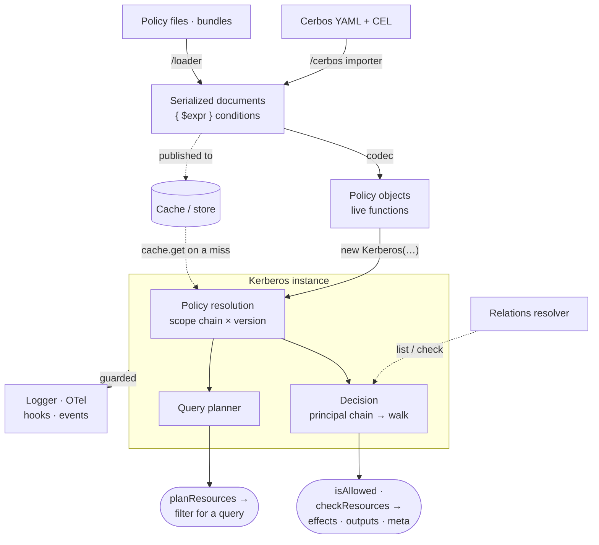
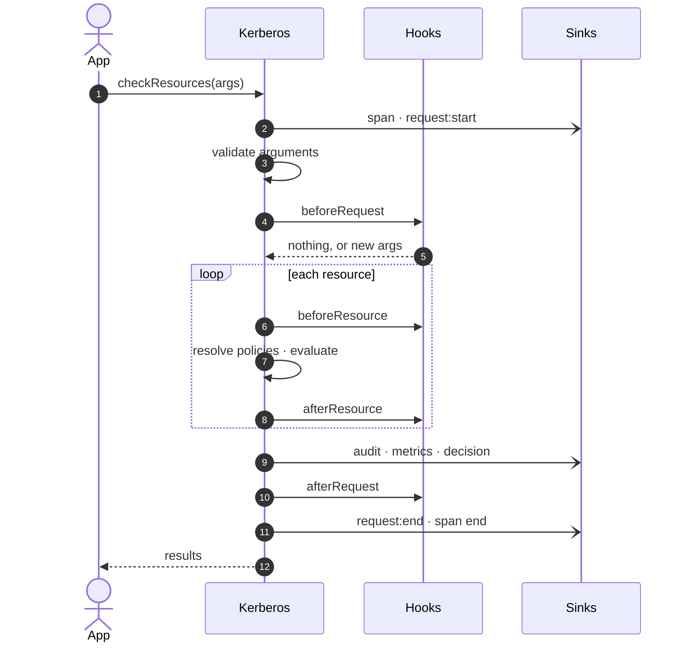
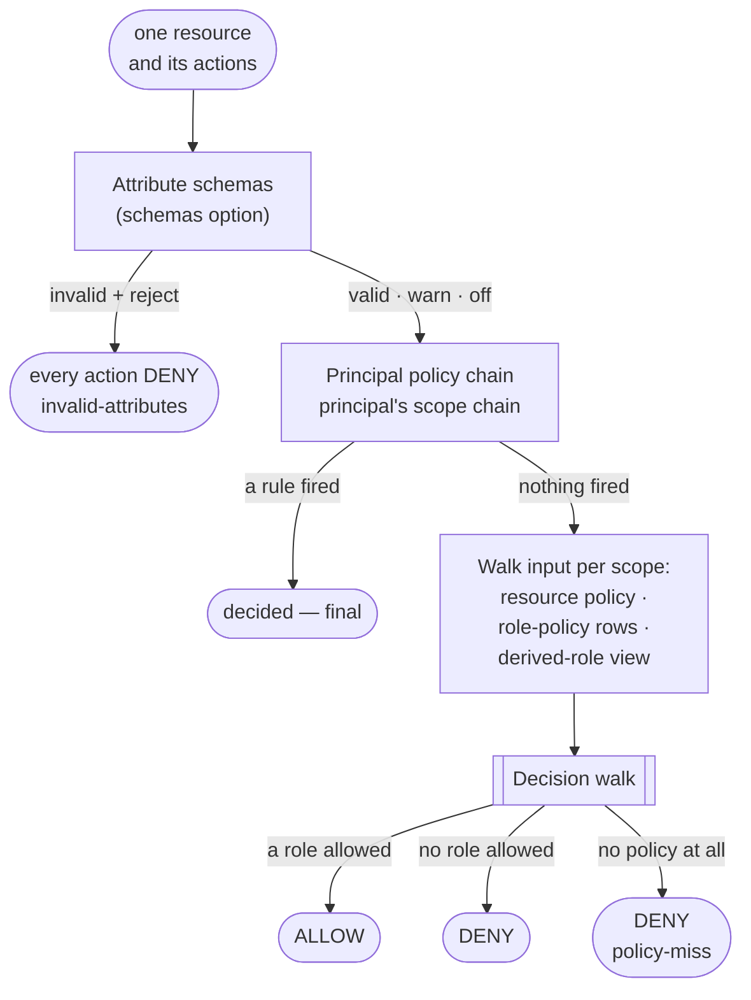
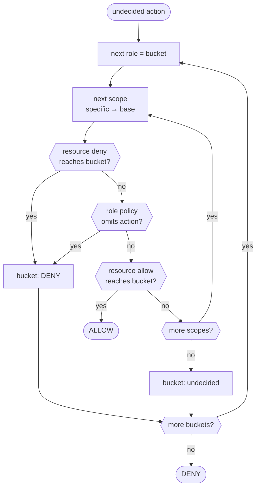
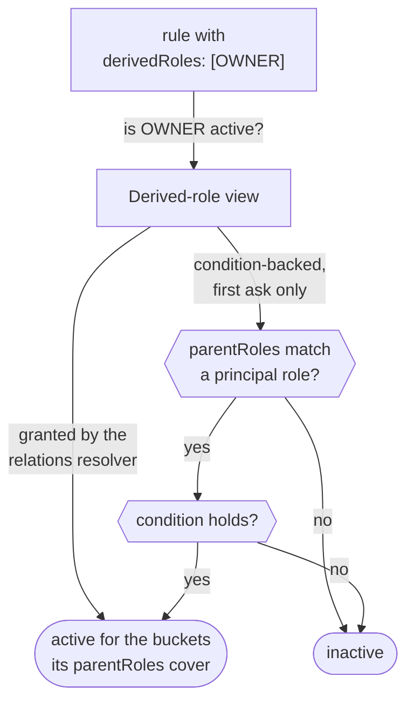
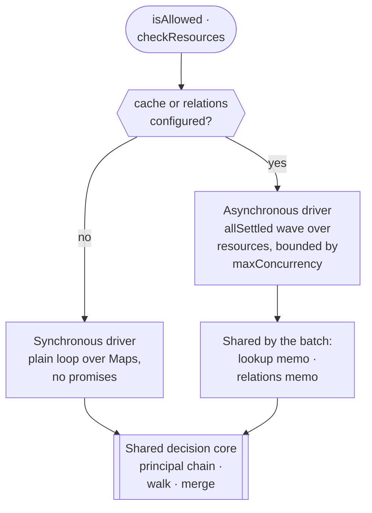
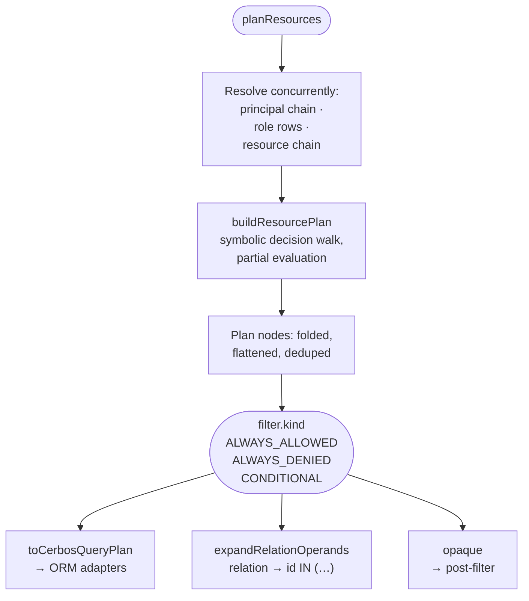
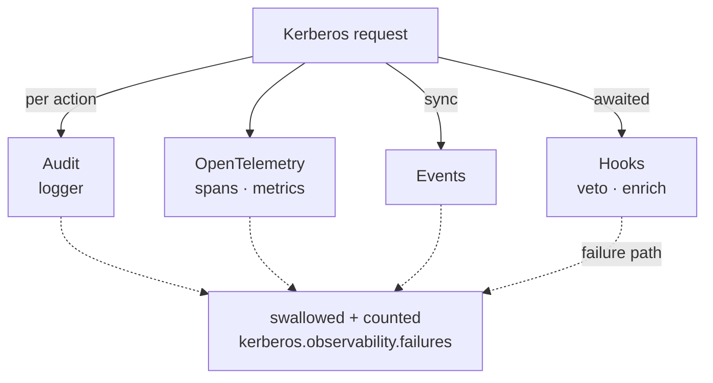

# Architecture

Kerberos.js is a library, not a service: every decision is a function call on one `Kerberos` instance, inside your own process. This page follows a request through that instance — where policies come from, how one resource is evaluated, how the per-role decision walk settles each action, and where the observability seams sit — and maps each step to the module that implements it. The topic pages go deeper; the links say where.

## The big picture

Every policy ends up as an instance of a policy class — built at construction from what you pass in, or built lazily from a cached document the first time a request needs it. JSON-shaped sources (Cerbos YAML through the [importer](/guide/cerbos-import), policy files through the [loader](/guide/policy-loader), documents in a [cache](/guide/caching)) meet the engine through the same [eval-free codec](/guide/serialization), which turns `{ $expr }` strings into evaluator functions. The engine never writes anywhere: the cache is read-only, the relations resolver is asked, and the observability sinks are told.

## Module map

Paths are relative to `src/`:

| Layer | Modules | Responsibility |
| ----- | ------- | -------------- |
| [Public API](/api/kerberos) | `Kerberos.js`, `lifecycle.js` | argument validation, the request lifecycle, the two evaluation drivers, response shaping |
| [Policy model](/guide/policy-types) | one folder per DSL concept: `ResourcePolicy/`, `DerivedRoles/`, `Conditions/`, … | parse and normalize a policy shape, evaluate its rules for one request |
| [Matching](/guide/scopes#wildcards) | `matching.js`, `ruleIndex.js` | Cerbos globs and kind sanitization, precompiled per rule; per-action / per-role rule indexes |
| [Decision](#the-decision-walk) | `decision.js`, `derivedRoleView.js` | the unified decision walk; derived roles resolved on demand |
| [Query planning](/guide/query-plans) | `planning/` | partial evaluation of `$expr` ASTs into a plan tree, Cerbos filter output, ORM and ReBAC bridges |
| [Dynamic policies](/guide/caching) | `caching/cache.js`, `caching/codec.js` | read-only cache reader with retries; the AST-allowlist `$expr` interpreter |
| [Validation](/guide/schema-validation) | `validation/`, `attributeSchemas.js` | pluggable Zod / JSON Schema / TypeBox backends; attribute-schema enforcement |
| [Observability](/guide/hooks) | `logging.js`, `telemetry.js`, `hooks.js`, `events.js` | audit entries, spans and metrics, awaited hooks, synchronous events |
| [Platform](/guide/installation#browser-usage) | `runtime/node.js`, `runtime/browser.js` | call ids and the clock — the only platform-specific files of the main entry |
| [Subpaths](/api/exports) | `Relations/`, `cerbos/`, `loader/`, `Tests/`; the CLI is `bin/kerberos.js` at the root | ReBAC resolver, Cerbos importer, Node file loader, test DSL, CLI — each bundled only when imported |

## Life of a request

All three public methods run inside one lifecycle wrapper. The sequence below is `checkResources`; `isAllowed` is the same with a single resource, and `planResources` replaces the per-resource evaluation with [query planning](#query-planning).

- **Errors.** An evaluation error (a throwing condition, an exhausted cache, a failing resolver, a vetoing hook) follows the `onError` option: `'throw'` rethrows it, `'deny'` returns a fail-closed result. Inside a `checkResources` batch a failing resource is isolated — its actions come back `EFFECT_DENY` with `reason: 'evaluation-error'`, and the other resources are unaffected. The failure path of the hooks is on the [hooks page](/guide/hooks#execution-order).
- **Concurrency.** With a cache or a relations resolver configured, the resources of a batch evaluate concurrently (bounded by `maxConcurrency`); otherwise they run in a plain synchronous loop — see [two drivers, one core](#two-drivers-one-core).
- **Positional results.** `results[i]` answers `resources[i]`, and the `onError: 'deny'` fallback keeps that shape too.

## Evaluating one resource

The evaluation of one resource draws on three policy sources, each selected by a different side of the request (see [which version applies to what](/guide/scopes#which-version-applies-to-what)):

The decision is made **per action**: a principal policy can decide `delete` while `view` falls through to the walk in the same request. Attribute-schema enforcement runs first, so under `reject` not even a principal policy can rescue a request with invalid attributes.

## The decision walk

Every action the principal chain left open goes through one walk ([`src/decision.js`](https://github.com/Alexis-Technologies/kerberos/blob/main/src/decision.js)), matching Cerbos's rule-table semantics and verified against a live PDP by the [conformance suite](https://github.com/Alexis-Technologies/kerberos/blob/main/conformance/README.md). It runs **per principal role** — each role is a *bucket* — and, inside a bucket, **down the resource's scope chain** from the most specific scope to the base:

- A rule **fires** when one of its `actions` globs matches and its condition holds. A rule whose condition fails decides nothing — the bucket falls through to the parent scope.
- A rule **reaches** a bucket through `roles` (glob-matched against the bucket's role, bare `*` reaches every bucket), or through an active derived role whose `parentRoles` cover the bucket's role.
- **Within a scope, deny beats allow** for the bucket, and the first scope that decides **seals** it.
- **Across buckets, an allow from any role wins** — holding an extra role can widen access, never take it away (anti-lockout).
- **Role policies never grant.** They only add synthetic deny rows: a role policy at a scope denies every action it does not allowlist there, for any resource kind, including kinds its rules never mention. The allow must still come from a resource rule reaching the same bucket.

A worked example — resource `doc` at scope `acme.corp` (search chain `acme.corp → acme → ''`), with these policies:

- base scope `''`: resource policy allows `view` and `edit` for roles `employee` and `contractor`;
- scope `acme`: resource policy denies `view` to `contractor` when `R.attr.confidential === true`;
- scope `acme`: role policy for `contractor` allowlists only `view` on `doc`.

For a confidential document, each bucket walks the chain like this:

| Scope | `view` · employee | `view` · contractor | `edit` · employee | `edit` · contractor |
| ----- | ----------------- | ------------------- | ----------------- | ------------------- |
| `acme.corp` | no policy, skipped | no policy, skipped | no policy, skipped | no policy, skipped |
| `acme` | the deny does not reach `employee` — falls through | **DENY** (resource rule) — sealed | nothing fires — falls through | **DENY** (the role policy does not allowlist `edit`) — sealed |
| `''` | **ALLOW** | not reached | **ALLOW** | not reached |

- Roles `['employee', 'contractor']` → `view` ✅, `edit` ✅: the `employee` bucket allows, and an allow from any role wins.
- Roles `['contractor']` → `view` ❌, `edit` ❌. For a non-confidential document the deny's condition fails, so `view` falls through to the base allow ✅, while `edit` stays denied by the role policy.

**Only what can affect the decision is evaluated.** A resource policy is evaluated per (scope, action) the first time the walk reaches it, with its constants and variables built once per scope; a role policy is evaluated the first time a bucket needs its verdict. A scope the walk never reaches for an action — because a more specific scope already decided it — runs no conditions (so an erroring condition there cannot fail the request) and emits no outputs. A default deny walks, and therefore evaluates, every scope. Behind the walk, `src/ruleIndex.js` narrows each policy to the rules whose `actions` can match the action (split by literal role once a policy has more than 8 rules) — always in rule order, so the index only shortens the scan.

### Derived roles, on demand

Derived roles do not form a dimension of their own: an active derived role reaches exactly the buckets its `parentRoles` cover (every bucket when it declares none, as a relation-backed definition may). They are resolved lazily, through one view per resource policy:

Relation-backed definitions (the `relation:` field) are the one asynchronous part of derived roles: before the walk, the engine collects the relation-backed names that a rule of the requested actions actually references, and asks the `relations` resolver about them in one batch — a single `list` call, or parallel `check` calls — see [ReBAC](/guide/rebac#how-the-engine-asks). Under `includeMeta` the remaining definitions are settled after the decision, so `meta.effectiveDerivedRoles` lists every active imported role.

## Where policies come from

Each of the three sources is a **chain**, not a single lookup: the engine walks the relevant scope search chain at a fixed `policyVersion` and collects every policy it finds, most specific first. At each scope the in-memory map is checked first and the cache only on a miss there — the details, including retries and corrupt entries, are on the [caching page](/guide/caching#how-it-works-fallback-layer).

Three shortcuts keep resolution cheap:

- the scope search chain for a scope string is computed once and memoized (bounded LRU);
- without a cache, an id that has no policy at any scope (no principal policy for this user, no role policy for this role) is skipped without probing a single key;
- with a cache, one `checkResources` batch shares a lookup memo, so each distinct lookup (source, id, version and scope) resolves once per batch however many resources need it — concurrent resources share the pending promise.

## Two drivers, one core

The zero-dependency baseline — static policies, no cache, no relations — never allocates a promise inside the evaluation. Both drivers call the same principal-chain evaluation, decision walk and merge step, so they cannot disagree; `test/SyncAsyncParity.test.js` pins that end to end. Per-resource hooks (`beforeResource` / `afterResource`) wrap either driver in an async frame; request-level hooks do not change the driver.

## Query planning

`planResources` reuses the same policy resolution, then hands everything to a pure, synchronous planner that mirrors the decision walk symbolically:

Name matching is fully static at plan time — the principal, the kind and the action are known — so only conditions over unknown resource fields stay residual. Whatever cannot be translated becomes an `opaque` node rather than a guess. Parity with `isAllowed` is enforced by a grid-sampling test suite; the composition itself is on the [query plans page](/guide/query-plans#how-a-plan-is-composed).

## Observability seams

Logging, telemetry and events are pure observation: every call into them is guarded, and a broken sink can never change a decision or the error contract — the failure is counted (and, for the logger, hooks and listeners, `console.warn`ed once per sink). Hooks are the deliberate exception — they run inside the request, so a hook can veto it by throwing or enrich it by returning replacement arguments from `beforeRequest`; everything else a hook returns is ignored. Each sink is a factory with a no-op disabled form, so an unconfigured one costs a single boolean check per call site.

## Platform split

Everything in `src/` is platform-neutral except the two runtime files (call ids and the clock) and the Node-only `/loader` subpath; browser bundlers swap both through the package's `browser` field — see [Browser usage](/guide/installation#browser-usage).
