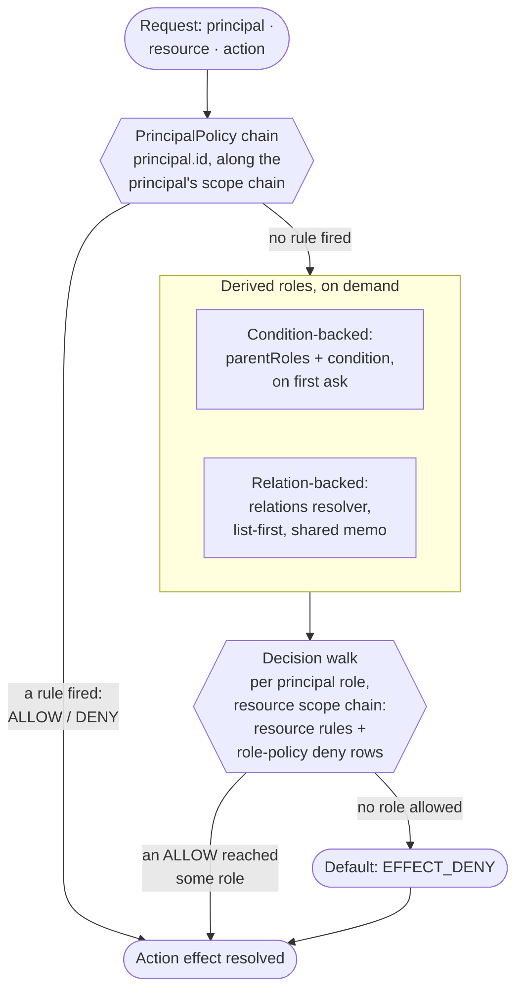

# Policy Types

Kerberos.js supports three policy types:

- **`resourcePolicy`**: selected by `resource.kind`, `resource.policyVersion`, and `resource.scope`
- **`principalPolicy`**: selected by `principal.id`, `principal.policyVersion`, and `principal.scope`
- **`rolePolicy`**: selected by each `principal.roles[]`, and — like resource policies — `resource.policyVersion` and `resource.scope`

You can pass either type on its own or mix them in the same constructor call:

```javascript
const kerberos = new Kerberos(
  [
    expenseResourcePolicy,
    sallyPrincipalPolicy,
    userRolePolicy,
  ],
  [commonRoles]
);
```

## ResourcePolicy

`ResourcePolicy` is the workhorse policy type, selected by `resource.kind`. Rules are matched by action, then by `roles` or `derivedRoles`, and may also use `conditions`, `variables`, `constants`, `outputs`, versions, and scopes — see the [Quick Start](/guide/getting-started) for a complete example.

### Conflict resolution

Conflicts are resolved **per principal role**, matching Cerbos: `EFFECT_DENY` overrides `EFFECT_ALLOW` **within** a role, and an `EFFECT_ALLOW` from **any** role wins across roles. Rule order never decides the outcome.

This is deliberate anti-lockout behaviour — picking up an extra, less privileged role can never take away access another role grants:

```javascript
rules: [
  { actions: ['close'], effect: Effect.Allow, roles: ['SUPPORT'] },
  { actions: ['close'], effect: Effect.Deny, roles: ['AUDITOR'] },
];
// principal roles ['SUPPORT', 'AUDITOR'] -> EFFECT_ALLOW
```

A deny that is meant to hold regardless has to cover the role carrying the allow — either with the `'*'` wildcard or by naming it:

```javascript
{ actions: ['close'], effect: Effect.Deny, roles: ['*'] }                 // always denies
{ actions: ['close'], effect: Effect.Deny, roles: ['SUPPORT', 'AUDITOR'] } // denies both roles
```

Derived roles do not form a dimension of their own: a rule reached through `derivedRoles` counts for the principal roles listed in that definition's `parentRoles`.

## PrincipalPolicy

`PrincipalPolicy` follows the Cerbos-style model for principal-specific overrides. It is bound to a single principal and targets `resource + action` directly instead of `roles` / `derivedRoles`.

```javascript
const sallyPrincipalPolicy = {
  principalPolicy: {
    principal: 'sally',
    version: 'default',
    scope: 'acme.corp',
    constants: {
      restrictedVendor: 'Flux Water Gear',
    },
    variables: {
      isRestrictedVendor: ({ R, C }) => R.attr.vendor === C.restrictedVendor,
    },
    rules: [
      {
        resource: 'expense',
        actions: [
          {
            name: 'deny-restricted-vendor-view',
            action: 'view',
            effect: Effect.Deny,
            condition: {
              match: ({ V }) => V.isRestrictedVendor,
            },
          },
          {
            name: 'allow-delete-override',
            action: 'delete',
            effect: Effect.Allow,
          },
        ],
      },
    ],
  },
};
```

## RolePolicy

`RolePolicy` follows the Cerbos-style role-centric model. It is bound to a single role, targets `resource + allowActions`, and acts as a **narrowing filter over the [`ResourcePolicy`](/guide/policy-types#resourcepolicy)** — it never grants on its own. Three consequences worth internalising:

- **A role policy cannot allow what the resource policy withholds.** The resource policy is always what grants; a role policy only takes away. With no matching `ResourcePolicy` at all, nothing is allowed.
- **Multiple role policies union.** A principal may do what **any** of its roles permits — provided the resource policy's allow reaches that same role (another role's allowlist cannot revive it). Holding an extra role can widen access, never narrow it.
- **A role without any role policy is unrestricted.** Its decisions come straight from the resource policy. A role that *has* a role policy, however, is constrained for **every** resource kind wherever that policy sits on the scope chain — a kind its rules never mention gets nothing for that role.

```javascript
// resourcePolicy `report` allows view + edit + delete for roles: ['*']
rolePolicy READER: allowActions: ['view']
rolePolicy WRITER: allowActions: ['edit']

roles: ['READER']            -> view                    (filtered to the allowlist)
roles: ['READER', 'WRITER']  -> view, edit              (union, not intersection)
roles: ['READER', 'PLAIN']   -> view, edit, delete      (PLAIN is unconstrained)
```

```javascript
const userRolePolicy = {
  rolePolicy: {
    role: 'USER',
    version: 'default',
    scope: 'acme.corp',
    constants: {
      restrictedVendor: 'Flux Water Gear',
    },
    variables: {
      isRestrictedVendor: ({ R, C }) => R.attr.vendor === C.restrictedVendor,
    },
    rules: [
      {
        resource: 'expense',
        allowActions: ['create'],
      },
      {
        resource: 'expense',
        allowActions: ['view'],
        condition: {
          match: ({ V }) => V.isRestrictedVendor === false,
        },
      },
    ],
  },
};
```

`RolePolicy` also supports `parentRoles`. Within a single role, the child keeps only actions that are **also** allowed by each locally defined parent role policy (intersection along the inheritance chain — distinct from the union *across* the principal's roles). Missing parent role policies are treated as external IdP roles and do not impose extra constraints inside Kerberos.

## Mixed Policy Evaluation

When mixed policy types are present, Kerberos resolves each action in this order:

1. **Principal policies first.** Walk the principal's scope chain: the first `PrincipalPolicy` whose rule fires for the action decides it (`EFFECT_DENY` beats `EFFECT_ALLOW` within a policy; a rule whose condition fails decides nothing and falls through to the parent scope). That decision is final — role policies never narrow a principal-policy override.
2. **Then one decision walk over resource and role policies**, run per principal role and down the resource's scope chain. At each scope a role sees the `ResourcePolicy` rules that fired and reach it — through `roles`, or through a derived role whose `parentRoles` cover it — plus a deny for every action that a `RolePolicy` at that scope (for the role or one of its `parentRoles` ancestors) does not allowlist. `EFFECT_DENY` beats `EFFECT_ALLOW` within a scope, the first scope that decides seals that role, and an `EFFECT_ALLOW` reached by **any** role wins.
3. Imported **derived roles are resolved lazily**: a condition-backed definition is evaluated only when a rule of the requested actions asks about it (once per request, however many scopes import it), and a relation-backed definition (the `relation:` field) resolves through the configured [`relations` resolver](/guide/rebac) (ReBAC) only when such a rule references it — `list`-first with parallel `check` fallback, one shared memo per request.
4. If nothing decides the action, return `EFFECT_DENY`.

The decision is computed **per action** — different actions in the same request may be resolved by different policy layers. Each lookup (principal / role / resource) walks the [scope search chain](/guide/scopes) at a fixed `policyVersion`, and checks in-memory policies first, then the optional `cache`.


```mermaid
flowchart TD
    A(["Request: principal ·<br/>resource · action"]) --> P{{"PrincipalPolicy chain<br/>principal.id, along the<br/>principal's scope chain"}}
    P -->|"a rule fired:<br/>ALLOW / DENY"| DONE(["Action effect resolved"])
    P -->|"no rule fired"| DR

    subgraph DR ["Derived roles, on demand"]
        SYNC["Condition-backed:<br/>parentRoles + condition,<br/>on first ask"]
        REL["Relation-backed:<br/>relations resolver,<br/>list-first, shared memo"]
    end

    DR --> WALK{{"Decision walk<br/>per principal role,<br/>resource scope chain:<br/>resource rules +<br/>role-policy deny rows"}}
    WALK -->|"an ALLOW reached<br/>some role"| DONE
    WALK -->|"no role allowed"| DEF(["Default: EFFECT_DENY"])
    DEF --> DONE
```

> **Within the role layer:** a role policy only takes away — it denies the actions it does not allowlist, and the allow must still come from a resource rule reaching the same role. Across roles the principal may do what **any** role allows (union); a role with no role policy at all is unrestricted. When a role declares `parentRoles`, the child keeps only the actions that are **also** allowed by each locally defined parent role policy (intersection along the chain). The [architecture page](/guide/architecture#the-decision-walk) walks through the full procedure with a worked example.

This keeps Kerberos.js aligned with the Cerbos-style principal override model described in the [Cerbos principal policies documentation](https://docs.cerbos.dev/cerbos/latest/policies/principal_policies) while extending the runtime with role-centric policy evaluation similar to [Cerbos role policies](https://docs.cerbos.dev/cerbos/latest/policies/role_policies).
