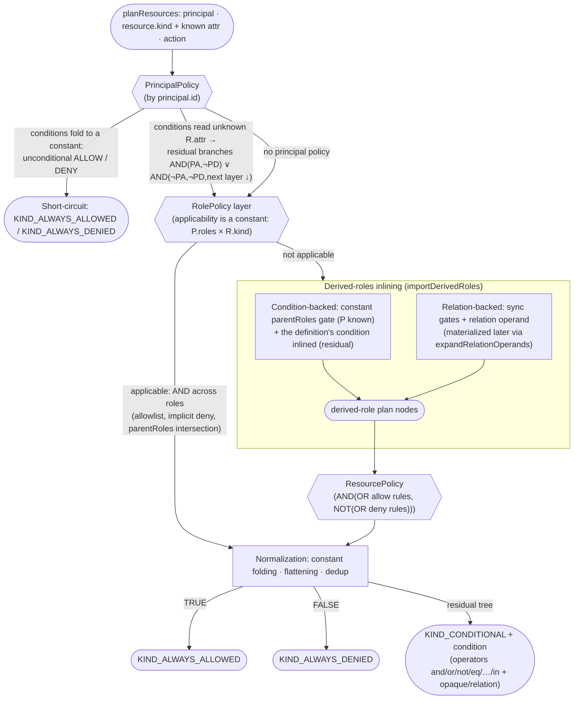

# Query Plans (planResources)

`isAllowed` answers *"may this principal act on **this** resource?"*. `planResources` answers the inverse — *"**which** resources may this principal act on?"* — by **partially evaluating** the policies against everything known at plan time (the full principal, `resource.kind`, any known `attr`) and returning a *filter* over the unknown resource fields. Translate that filter into a `WHERE` clause and the database returns exactly the permitted rows — no fetch-all-then-filter.

The response is shaped like the [Cerbos PlanResources API](https://docs.cerbos.dev/cerbos/latest/api/#resources-query-plan) (`filter.kind` + `condition` operand tree, same operator vocabulary), so Cerbos-ecosystem query-plan adapters ([queryPlanToPrisma](https://github.com/cerbos/query-plan-adapters), etc.) understand the shape. Kerberos adds two operators of its own: [`opaque`](#opaque-conditions-post-filtering) and [`relation`](#relation-operands-rebac).

```javascript
const { Kerberos, createSafeExprCodec, deserializePolicy } = require('@alexify/kerberos');

const codec = createSafeExprCodec({ jsep });
const policy = deserializePolicy({
  resourcePolicy: {
    resource: 'expense',
    version: 'default',
    rules: [
      { actions: ['view'], effect: 'EFFECT_ALLOW', roles: ['USER'],
        condition: { match: { $expr: "R.attr.ownerId === P.id || R.attr.status === 'APPROVED'" } } },
    ],
  },
}, codec);

const kerberos = new Kerberos([policy], []);
const plan = await kerberos.planResources({
  principal: { id: 'u1', roles: ['USER'] },
  resource: { kind: 'expense' },
  action: 'view',
});
// plan.filter:
// {
//   kind: 'KIND_CONDITIONAL',
//   condition: { expression: { operator: 'or', operands: [
//     { expression: { operator: 'eq', operands: [{ variable: 'request.resource.attr.ownerId' }, { value: 'u1' }] } },
//     { expression: { operator: 'eq', operands: [{ variable: 'request.resource.attr.status' }, { value: 'APPROVED' }] } },
//   ] } },
// }
```

Unconditional outcomes short-circuit: `filter.kind` is `KIND_ALWAYS_ALLOWED` / `KIND_ALWAYS_DENIED` with no `condition` (skip the query, or return everything/nothing).

## How a plan is composed

The planner mirrors [Mixed Policy Evaluation](/guide/policy-types#mixed-policy-evaluation) symbolically, layer by layer. Which layer decides is already known at plan time (it depends only on the principal and `resource.kind`); what stays *unknown* is only whether rule conditions over unknown `R.attr` / `R.id` hold — those become the residual filter:



Every layer keeps its runtime semantics: principal rules override (Deny wins), the role layer is an allowlist with implicit deny and `parentRoles` intersection, the resource layer resolves conflicts per principal role (deny over allow within a role, allow over deny across roles) with default deny — the parity is enforced by a property-style test suite ([`test/PlanParity.test.js`](https://github.com/Alexis-Technologies/kerberos/blob/main/test/PlanParity.test.js)) that grid-samples unknown attributes and compares the filter against real `isAllowed` results.

## Operators

`condition` is a tree of `{ expression: { operator, operands } }` / `{ variable }` / `{ value }` operands. Variables are Cerbos-named: `request.resource.id` and `request.resource.attr.<path>`.

The vocabulary is Cerbos' operator set plus two Kerberos extensions (`opaque`, `relation`) — see [Plan operators](/reference/plan-operators) for the full table.

## Writing plannable policies

The planner works on the codec's `{ $expr }` ASTs, so **plannable conditions are the ones the [safe expression codec](/guide/serialization) compiled** — cache-loaded policies, or static policies passed through `deserializePolicy(json, codec)` first. Rules of thumb:

- **Author conditions as `{ $expr: '…' }`**, not JS functions — a plain function is a black box and plans as `opaque`.
- **Prefer `===` over `==`** — both map to `eq`, but SQL `=` has no JS coercion semantics.
- **Compare booleans explicitly** (`R.attr.isPublic === true`): a bare `R.attr.isPublic` leaf is planned as `eq(attr, true)`, which diverges for truthy non-boolean values.
- **`.includes` means list membership** — use it on array attrs (a residual receiver is assumed to be a list; a constant *string* receiver would mean substring semantics and plans as `opaque`).
- Not plannable (always sound, degrade to `opaque`): `??`, `**`, bitwise ops, `typeof`, ternaries whose test reads unknown attrs, method calls other than `.includes`, `Math`/`Date` over unknown values, object/`new` expressions over unknown values.
- **Filters are guaranteed JSON-safe.** A folded constant that JSON transport would corrupt (`undefined` vanishes, `NaN`/`Infinity` become `null`, `Date` objects become strings, `BigInt` throws) is never emitted into an operand — the condition degrades to `opaque` instead. Comparing against possibly-missing principal attrs (`R.attr.owner === P.attr.dept` with no `dept`) therefore plans as `opaque`, not as a broken operand.
- An attr **missing** from `resource.attr` means *unknown*, not `undefined` — it becomes a filter variable, never a folded value.
- `Date.now()` (and friends) evaluate **at plan time** — same trade-off as Cerbos. A cached/reused plan carries a *frozen* time boundary; re-plan when time matters.

`variables` are partially evaluated and inlined at their `V.*` use sites; `C.*` constants and everything derivable from `P` fold into literal values. Plain JS-function *variables* still fold when they only touch known fields (they are executed against a guard that marks any unknown-field access as `opaque`).

## Opaque conditions (post-filtering)

`{ operator: 'opaque', operands: [{ value: { src, reason } }] }` marks a spot the planner could not translate (`reason: 'js-function' | 'unsupported-expression'`, `src` identifies the condition). A translator must treat it as *unknown*: fetch the candidate rows matching the rest of the filter, then post-filter each row with a real `isAllowed` call. Everything AND-ed around an opaque node still narrows the fetch.

## Relation operands (ReBAC)

[Relation-backed derived roles](/guide/rebac#relation-backed-derived-roles) plan as `{ operator: 'relation', operands: [{ value: { name, relation } }] }` — the ABAC part of the filter is complete, the ReBAC part depends on relationship data. Materialize it with `expandRelationOperands`:

```javascript
const { expandRelationOperands } = require('@alexify/kerberos');
const { RelationResolver } = require('@alexify/kerberos/relations');

const resolver = new RelationResolver({ schema, tuples });
const expanded = await expandRelationOperands(plan, ({ relation }) =>
  resolver.lookupResources({ subject: `user:${principal.id}`, permission: relation, resourceType: 'document' }));
// every relation operand becomes: in(request.resource.id, ['doc1', 'doc7', …])
// (an empty id list folds the branch to FALSE — possibly the whole plan to KIND_ALWAYS_DENIED)
```

The lookup is any `({ name, relation }) => ids` function — resolver-agnostic, like the engine's `relations` seam. Without expansion, treat `relation` like `opaque`: post-check the rows. Mind the cardinality: a principal with access to a very large set of resources materializes a very large `in`-list — for those cases a post-check (or a resolver-side limit) can beat expansion.

## Using the official Cerbos ORM adapters

Cerbos's own [query-plan adapters](https://github.com/cerbos/query-plan-adapters) — [`@cerbos/orm-prisma`](https://www.npmjs.com/package/@cerbos/orm-prisma) and [`@cerbos/orm-drizzle`](https://www.npmjs.com/package/@cerbos/orm-drizzle) — accept Kerberos plans through one exported hop: `toCerbosQueryPlan` converts the HTTP-API operand encoding Kerberos emits (`{ variable }` / `{ expression }`) into the flattened `@cerbos/core` SDK encoding the adapters consume (`{ name }` / `{ operator, operands }`; the plan kinds are byte-identical):

```javascript
import { toCerbosQueryPlan, expandRelationOperands } from '@alexify/kerberos';
import { queryPlanToPrisma } from '@cerbos/orm-prisma';

const plan = await kerberos.planResources({ principal, resource: { kind: 'document' }, action: 'view' });
const result = queryPlanToPrisma({
  queryPlan: toCerbosQueryPlan(plan),
  mapper: {
    'request.resource.attr.ownerId': { field: 'ownerId' },
    'request.resource.id': { field: 'id' },
  },
});
// result.kind: ALWAYS_ALLOWED | ALWAYS_DENIED | CONDITIONAL (+ result.filters for Prisma's `where`)
```

The two Kerberos-only operators follow the refuse-to-guess rule at this boundary:

- **`relation`** (ReBAC dependency) — materialize it first: `toCerbosQueryPlan(await expandRelationOperands(plan, lookup))`; the expanded plan renders as a plain `id IN (...)` filter. Handing an *unexpanded* plan to the converter throws, naming `expandRelationOperands`.
- **`opaque`** (statically unplannable condition) — the converter throws with a post-filtering directive; translate the rest of the query and filter the rows through `checkResources` afterwards.

This path is CI-verified against the real adapter packages (`test/OrmAdapters.test.js`): conditional/membership plans render the expected Prisma `where` objects and Drizzle SQL, and both special operators take exactly the routes above.

One caveat that is not ours: the adapter packages are CommonJS but depend on the ESM-only `@cerbos/core`, so **loading them** needs Node's `require(esm)` support — Node **20.19+ / 22.12+**. On Node 18 they cannot be required at all, and the verification suite skips accordingly. `toCerbosQueryPlan` itself, like the rest of Kerberos, runs on Node 18; only the third-party adapters are gated.

## Translating a plan

Translators are deliberately **not** part of the package (same delegation philosophy as caching/validation). A hand-rolled SQL mapping is a ~40-line recursive walk:

```javascript
const OPS = { and: 'AND', or: 'OR', eq: '=', ne: '<>', lt: '<', le: '<=', gt: '>', ge: '>=' };

function toSql(operand, params) {
  if ('value' in operand) return params.push(operand.value), `$${params.length}`;
  if ('variable' in operand) {
    if (operand.variable === 'request.resource.id') return 'id';
    return operand.variable.replace('request.resource.attr.', ''); // map to your column names
  }
  const { operator, operands } = operand.expression;
  if (operator === 'not') return `NOT (${toSql(operands[0], params)})`;
  if (operator === 'in') return `${toSql(operands[0], params)} = ANY(${toSql(operands[1], params)})`;
  if (OPS[operator]) return `(${operands.map((op) => toSql(op, params)).join(` ${OPS[operator]} `)})`;
  throw new Error(`post-filter required: ${operator}`); // opaque / relation / index / list…
}

const params = [];
const where =
  plan.filter.kind === 'KIND_ALWAYS_ALLOWED' ? 'TRUE'
  : plan.filter.kind === 'KIND_ALWAYS_DENIED' ? 'FALSE'
  : toSql(plan.filter.condition, params);
```

Since the shape matches Cerbos, the [Cerbos ORM adapters](https://docs.cerbos.dev/cerbos/latest/recipes/orm/) (Prisma, Drizzle, Mongoose, SQLAlchemy…) accept the `filter` for the shared operator vocabulary — route `opaque`/`relation` operands to a post-filter (or pre-expand `relation` as shown above).

Two operational notes:

- **Plans disclose folded principal data.** Partial evaluation inlines values derived from `P`/`C`/`V` into the filter and `filterDebug` — treat plans as output for trusted sinks (your translator/backend), not for untrusted clients. See [SECURITY.md](/reference/security).
- **Plans are observable.** Each call records the outcome: a structured `PlanResources.result` audit entry (filter kind, opaque/relation counts), span attributes (`kerberos.plan.kind`, `kerberos.plan.opaque_count`, …) and the [`kerberos.plans` counter](/guide/telemetry) — an `ALWAYS_ALLOWED` filter (a fail-open query) never goes unnoticed.
