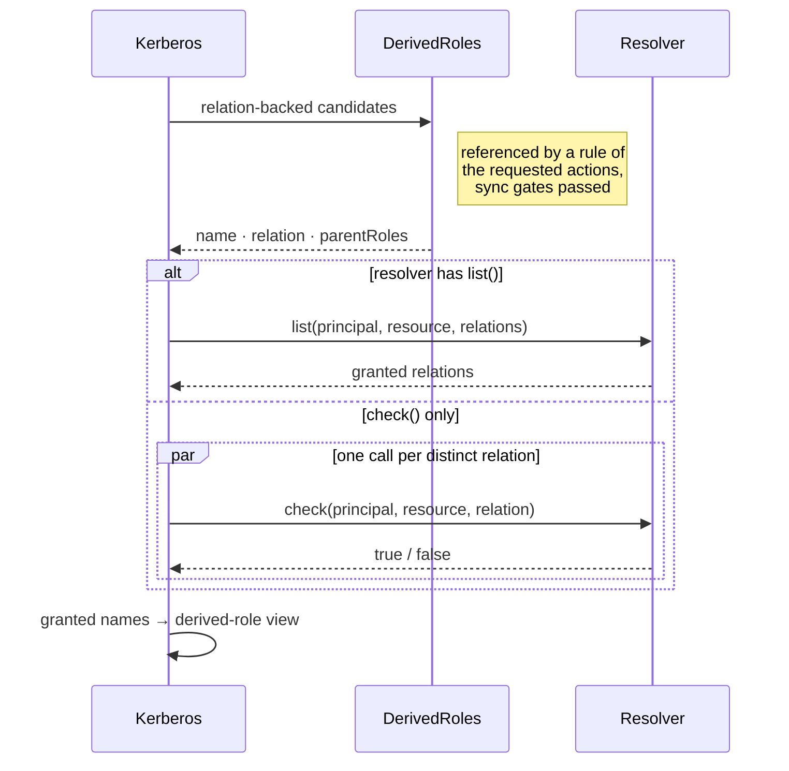

# ReBAC (Relations)

Kerberos supports **relationship-based access control** (ReBAC) — "Google Drive-style" authorization where access flows through relationships (`viewer of the parent folder`, `member of the team that owns the document`) instead of attributes alone. The design is heavily inspired by [SpiceDB](https://github.com/authzed/spicedb) (the mature open-source implementation of Google's Zanzibar), adapted to the Kerberos philosophy: **in-process, zero-infra**, static data blazing fast, dynamic data through the same read-only `cache` fallback used for policies.

It comes in two layers:

1. **The `relations` engine option** — a delegation contract like `logger`/`cache`/`codec`. ANY object with a `check` method works, including a resolver backed by the join tables your database already has.
2. **The built-in "Zanzibar-lite" resolver** — the `RelationResolver` class from the **`@alexify/kerberos/relations`** subpath (kept out of the main entry so non-ReBAC browser bundles do not grow).

## Relation-backed derived roles

A derived-role definition may declare a `relation` instead of a `condition`. When the engine resolves derived roles for a resource policy (its only async phase), it asks the configured `relations` resolver whether the principal holds that relation/permission on the request's resource — and the role activates like any other derived role:

```javascript
const derivedRoles = {
  name: 'doc_roles',
  definitions: [
    // Classic (condition-backed) definitions still work unchanged:
    { name: 'OWNER', parentRoles: ['USER'], condition: { match: ({ P, R }) => R.attr.ownerId === P.id } },
    // Relation-backed: activates when relations.check grants `view`.
    // `parentRoles` and `condition` become optional synchronous gates.
    { name: 'DOC_VIEWER', relation: 'view' },
  ],
};

const policy = {
  resourcePolicy: {
    version: 'default',
    resource: 'document',
    importDerivedRoles: ['doc_roles'],
    rules: [{ actions: ['view'], effect: 'EFFECT_ALLOW', derivedRoles: ['DOC_VIEWER', 'OWNER'] }],
  },
};
```

The delegation contract (bring your own resolver — e.g. SQL joins over your own tables):

```javascript
const kerberos = new Kerberos([policy], [derivedRoles], {
  relations: {
    // Required. `memo` is a request-scoped Map shared across a whole
    // checkResources batch — use it to share subproblems if you want.
    async check({ principal, resource, relation }, { memo }) {
      return db.hasRelation(principal.id, resource.kind, resource.id, relation);
    },
    // Optional batch fast path — called first when present.
    async list({ principal, resource, relations }, { memo }) {
      return db.grantedRelations(principal.id, resource.kind, resource.id, relations); // Set<string>
    },
  },
});
```

Resolver failures follow the [`onError`](/guide/configuration) semantics, per-resource isolation in `checkResources` applies as usual, and with `includeMeta` every relation resolution is visible in `meta.resolution` as `{ source: 'relations', name, relation, matched }`.

## How the engine asks

Relation-backed definitions are resolved once per resource policy, before the [decision walk](/guide/architecture#the-decision-walk) starts — the only asynchronous step of derived-role resolution:



Several definitions pointing at the same relation cost one call. With `relationsTimeoutMs` set, a resolver call that never settles fails as `KerberosRelationsError` instead of hanging the request. The `memo` is one `Map` per public call, shared by every resource of a `checkResources` batch, so a resolver that honours it (the built-in one does) evaluates each subproblem once per batch.
